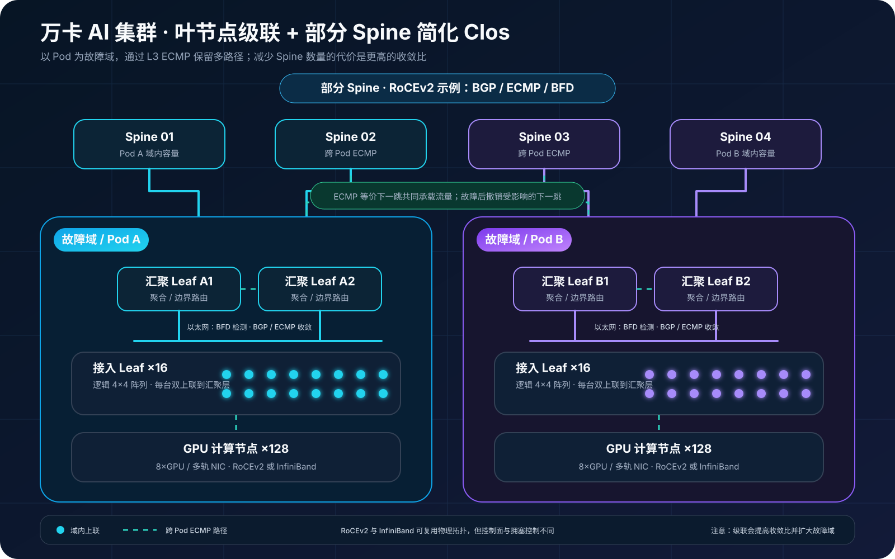

## 0. 前言

最近开始接触万卡规模的 AI 集群。面对计算、网络、存储和调度组成的庞大体系，我决定先从组网开始理解，因为网络会直接影响 GPU 集群的通信效率和整体性能。

本文作为万卡集群网络方向的第一篇学习记录，将从 Clos 架构出发，梳理几种常见的 AI 组网方案及其在带宽、成本和故障域之间的取舍。

## 1. Clos 到底是什么

数据中心里常说的 Leaf-Spine，通常是折叠后的 Clos（Folded Clos）：服务器接入 Leaf，每台 Leaf 再连接全部 Spine；同一 Leaf 下的流量本地转发，跨 Leaf 流量经过一个 Spine，形成多个等价的三跳路径。

Clos 的价值不只是“有很多链路”，而是：

- **多路径**：L3 ECMP 可以把不同流分散到多个 Spine；
- **横向扩容**：增加 Spine 或扩展 Pod，可逐步增加容量；
- **故障隔离**：单链路或单 Spine 故障不应中断整个 Fabric；
- **带宽可计算**：端口数量和速率可以直接换算成收敛比。

如果每台 Leaf 的下行总带宽等于上行总带宽，通常称为 1:1 无阻塞；若下行 25.6 Tb/s、上行 12.8 Tb/s，则过订阅比为：

```text
过订阅比 = 下行总带宽 / 上行总带宽 = 25.6 / 12.8 = 2:1
```

1:1 并不保证应用一定跑满，但 2:1 意味着在最坏的跨 Leaf 流量下，每个端点理论上最多只能获得一半线速。对 AI 集群，容量规划应按 Collective 通信矩阵和并发突发计算，不能只看端口平均利用率。

## 2. AI 集群常见的五类架构

### 2.1 双 Leaf 或 Collapsed Fabric

小规模集群可用一对交换机直接承载服务器双归属，省略独立 Spine。它的布线简单、成本低、跳数少，适合 PoC、小型推理池或规模固定的训练环境。

短板也很直接：端口很快耗尽，交换机既是接入层又是汇聚层，扩容往往需要整体迁移。它更像 Clos 的起点，而不是面向万卡的终态。

### 2.2 标准两层 Leaf-Spine

这是最常见的 Folded Clos。每台 Leaf 连接全部 Spine，服务器按双归属或多轨方式接入。只要上下行带宽按 1:1 配置，跨 Leaf 通信即可保持无阻塞，路径数量和故障行为也比较清晰。

它适合中大型训练集群，代价是 Spine 端口、光模块和光纤数量较多。随着 Leaf 数量增加，Spine 端口密度会成为单 Fabric 的规模上限。

### 2.3 三层 Clos 与 Super-Spine

当两层网络无法继续容纳 Leaf，常在多个 Leaf-Spine Pod 之上增加 Super-Spine。这样可以把规模扩展到更大的节点数量，但跨 Pod 流量会多经过一层，容量规划、路由收敛和故障域都会更复杂。

[NVIDIA NVL72 AI Factory 参考架构](https://docs.nvidia.com/enterprise-reference-architectures/nvl72-ai-factory/latest/network-logical-architecture.html)将 Super-Spine 描述为超大规模部署的扩展方式，并以约 1024 节点以上作为其设计示例。这个数字不是通用分界线，实际阈值仍取决于交换机 radix、端口速率和每节点 NIC 数量。

### 2.4 Rail-Optimized 多平面 Clos

多 GPU 服务器通常有多张高速 NIC。Rail-Optimized 设计会把不同服务器上相同位置的 GPU/NIC 接入同一个网络平面，例如 GPU0 走 Rail 0、GPU1 走 Rail 1。这样可让 NCCL 更容易选择对称路径，降低局部热点，并把故障限制在单个 Rail。

[NVIDIA HGX AI Factory 参考架构](https://docs.nvidia.com/enterprise-reference-architectures/hgx-ai-factory/latest/network-logical-architecture.html)采用无阻塞 Leaf-Spine 和 Rail-Optimized RDMA 网络；[DGX SuperPOD H100 参考架构](https://docs.nvidia.com/dgx-superpod/reference-architecture-scalable-infrastructure-h100/latest/network-fabrics.html)也按 Rail 组织计算网络，并将计算、存储、带内管理与带外管理拆分成独立 Fabric。

多平面的代价是交换机和布线数量增加，运维必须保证各 Rail 的配置、MTU、拥塞控制和链路状态一致，否则应用看到的会是“总带宽很高，但最慢 Rail 拖住全局”。

### 2.5 叶节点级联 + 部分 Spine

原方案采用“两层叶节点级联＋部分 Spine”的简化 Clos：每 16 台接入 Leaf 组成一个逻辑故障域，先汇聚到一对 Leaf，再上联部分部署的 Spine。它可以减少 Spine、光模块和长距离光纤，适合预算受限、机柜距离较远，或大多数通信能够被调度在 Pod 内的场景。



图中各层职责如下：

| 层级 | 主要职责 | 设计重点 |
| --- | --- | --- |
| Spine | 连接多个 Leaf 故障域、承载跨组流量 | 多下一跳、ECMP、BFD、按容量扩展 |
| 汇聚 Leaf | 汇聚接入 Leaf 并连接 Spine | 双机冗余、控制过订阅、避免单点 |
| 接入 Leaf | 接入 GPU 服务器和多轨 NIC | Rail 隔离、MTU、PFC/ECN 一致性 |
| GPU 节点 | 执行训练和 Collective 通信 | GPU-NIC 亲和、NCCL 拓扑感知 |

这并不是严格意义上的全互联、无阻塞两层 Clos，因为接入 Leaf 到汇聚 Leaf 之间增加了汇聚点。它真正成立需要满足三个前提：

1. Pod 内通信占比足够高，并且调度器能够尽量把同一训练任务放在同一故障域；
2. 汇聚 Leaf 的上下行端口和交换容量能够覆盖目标收敛比；
3. 跨 Pod 的最坏流量模型经过 NCCL 实测，而不是只依据平均带宽估算。

原始方案给出的“交换机数量降低约 40%”可以作为设计目标，但不能直接视为结论。最终节省比例必须把交换机型号、端口速率、Breakout、备用端口、光模块、线缆距离和冗余方式放入 BOM 后重新计算。

## 3. ECMP 不等于无损网络

这是 AI 以太网设计中最容易混淆的一点。BGP Underlay、ECMP 和 BFD 解决的是**可达性、多路径和故障收敛**；它们不会自动解决微突发、队列拥塞和丢包。

RoCEv2 还需要成套验证：

- PFC 的优先级与 Headroom，避免 Pause 风暴和死锁；
- ECN 标记阈值与 DCQCN 参数，让发送端在丢包前降速；
- 端到端 MTU 一致，避免隐蔽分片或黑洞；
- 交换机缓存水位、队列映射和 QoS 策略一致；
- ECMP 哈希有足够熵，避免大量大象流压到同一条链路。

如果采用 InfiniBand，拥塞控制和管理机制不同，但“拓扑、路由、端点配置必须联合验证”的原则不变。

## 4. 计算网、存储网和管理网要不要分开

大规模集群通常至少包含四类流量：GPU Collective、训练数据读取、带内业务管理、BMC/设备带外管理。把它们全部放在同一 Fabric 上虽然省设备，但故障和拥塞会相互传导。

更稳妥的方式是：

- **计算 Fabric**：承载 GPU 间 RDMA 和 NCCL；
- **存储 Fabric**：承载数据集、Checkpoint 和分布式文件系统；
- **带内管理网**：承载 OS、容器平台和业务控制面；
- **带外管理网**：承载 BMC、交换机管理和故障救援。

物理上无法完全分开时，也至少要通过 VRF/VLAN、QoS 和独立故障策略隔离。NVIDIA 的 [DGX SuperPOD 网络设计](https://docs.nvidia.com/dgx-superpod/reference-architecture-scalable-infrastructure-h100/latest/network-fabrics.html)采用的正是多 Fabric 思路。

## 5. 如何选择

| 场景 | 更合适的架构 | 主要理由 | 首要风险 |
| --- | --- | --- | --- |
| PoC、小型推理池 | 双 Leaf / Collapsed | 成本低、交付快 | 端口耗尽后难扩容 |
| 中大型训练集群 | 两层无阻塞 Clos | 带宽和故障行为可预测 | 光模块与布线成本 |
| 超大规模、多 Pod | 三层 Clos / Super-Spine | 跨 Pod 横向扩展 | 跳数、收敛和运维复杂度 |
| 多 NIC、多 GPU 训练 | Rail-Optimized 多平面 | 拓扑对称、故障隔离 | 多 Rail 一致性 |
| 预算敏感、Pod 内通信为主 | 级联 Leaf + 部分 Spine | 降低核心设备和长距光纤 | 过订阅与汇聚层瓶颈 |

选择时不要先问“用几台交换机”，而要先确定节点数量、每节点 NIC 数量与速率、允许的收敛比、作业跨 Pod 比例、单次故障允许损失的 GPU 数量，以及未来两个扩容阶段。拓扑只是这些约束的结果。

## 6. 上线前必须做的验证

纸面带宽无法替代压力测试。建议至少完成以下五组验收：

1. **容量计算**：逐层列出端口、速率和收敛比，分别计算 Pod 内、跨 Pod 和最坏单故障场景；
2. **RDMA 基线**：用 perftest 测单流、多流、并发和跨故障域的吞吐、时延与丢包；
3. **Collective 实测**：用 NCCL Tests 测 AllReduce、AllGather、ReduceScatter 和 All-to-All，重点看 bus bandwidth 与尾部抖动；
4. **故障演练**：依次断开单链路、单 Spine、单汇聚 Leaf，记录 BFD/BGP 收敛时间、作业是否中断和是否出现乱序；
5. **拥塞观测**：持续采集 PFC Pause、ECN、CNP、队列水位、端口丢弃、ECMP 路径分布和 RDMA 重传。

[NCCL 性能调优文档](https://docs.nvidia.com/deeplearning/nccl/archives/nccl_2307/user-guide/docs/troubleshooting/performance_and_tuning.html)可用于定位拓扑与传输层限制；机房落地还应建立端到端线缆矩阵、物理距离和标签规范，可参考 [DGX SuperPOD 布线设计指南](https://docs.nvidia.com/dgx-superpod/design-guide-cabling-data-centers/latest/document-network.html)。

## 结语

标准 Clos 追求的是带宽和故障行为可预测；Rail-Optimized 进一步让网络拓扑贴合 GPU/NIC 拓扑；叶节点级联与部分 Spine 则用可控的过订阅交换成本。三者没有绝对优劣，关键是让交换机端口模型、训练通信模式、调度策略和故障域互相匹配。

对于万卡级集群，最危险的不是选择了一个“非标准”拓扑，而是没有把它的过订阅、热点和故障边界量化。先算清楚，再用 RDMA 与 NCCL 复现最坏场景，才能把一张架构图变成可交付的生产网络。

> 本文依据提供的飞书方案《万卡 AI 集群：叶节点级联与部分脊节点网络架构》整理并扩写；架构图按原白板信息重新绘制为可缩放 SVG，原始白板导出图一并保留在文章资源目录中。
