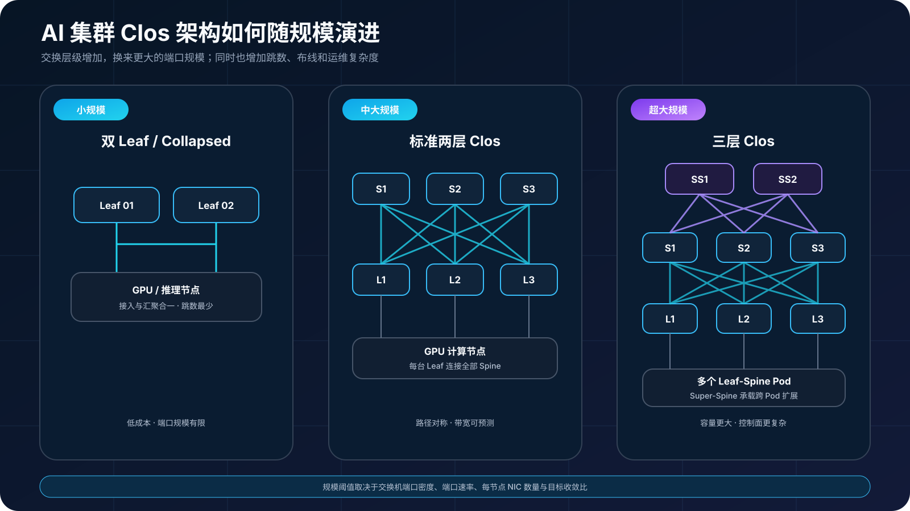
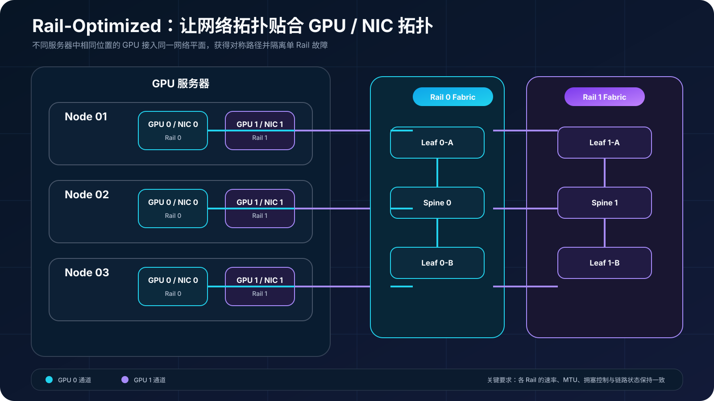
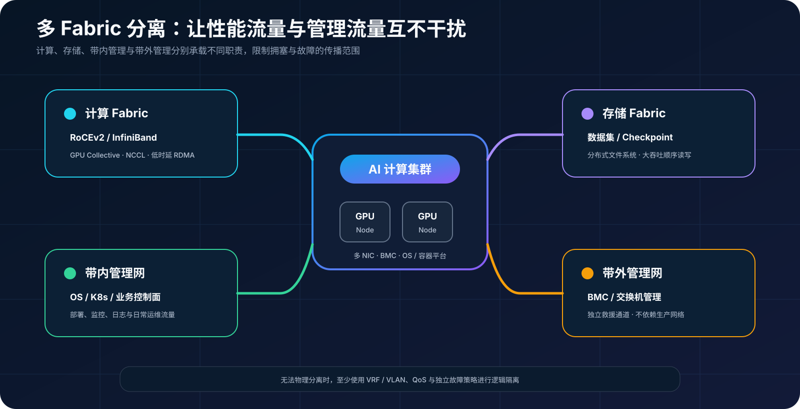

## 0. 前言

最近开始接触万卡规模的 AI 集群。面对计算、网络、存储和调度组成的庞大体系，我决定先从组网开始理解，因为网络会直接影响 GPU 集群的通信效率和整体性能。

本文作为万卡集群网络方向的第一篇学习记录，将从 Clos 架构出发，梳理几种常见的 AI 组网方案及其在带宽、成本和故障域之间的取舍。

## 1. Clos 到底是什么

数据中心里常说的 Leaf-Spine，通常是折叠后的 Clos（Folded Clos）：服务器接入 Leaf，每台 Leaf 再连接全部 Spine；同一 Leaf 下的流量由本地 Leaf 转发，跨 Leaf 流量则依次经过源 Leaf、一个 Spine 和目的 Leaf，形成多条等价路径。

[IETF RFC 7938](https://datatracker.ietf.org/doc/rfc7938/)将其描述为三阶段 Folded Clos，并明确 ECMP 是这类拓扑的基础负载分担机制。工程上常说的“两层”指 Leaf 和 Spine 两个交换机层级，与“三阶段 Clos”的输入、中心、输出阶段表述并不矛盾。

Clos 的价值不只是“有很多链路”，而是：

- **多路径**：L3 ECMP 可以把不同流分散到多个 Spine；
- **横向扩容**：在预留端口和布线的设计范围内增加 Spine，或通过新增 Pod 扩展容量；
- **冗余与故障隔离**：单链路或单 Spine 故障后，Fabric 仍可保留可达路径；
- **带宽可计算**：端口数量和速率可以直接换算成收敛比。

如果每台 Leaf 的下行总带宽等于上行总带宽，通常称为 1:1 收敛比，并可在满足设备线速转发和合理流量矩阵等条件时构成无阻塞拓扑；若下行 25.6 Tb/s、上行 12.8 Tb/s，则收敛比为：

```text
收敛比 = 下行总带宽 / 上行总带宽 = 25.6 / 12.8 = 2:1
```

1:1 不等于应用一定能跑满，因为 ECMP 哈希碰撞、突发拥塞和端点性能仍可能形成瓶颈。2:1 表示全部下行同时经过上联时，上联只能提供下行总需求一半的聚合容量；单个端点的实际吞吐还取决于流量分布和拥塞控制。对 AI 集群，容量规划应按集合通信（Collective）的通信矩阵和并发突发计算，不能只看端口平均利用率。

## 2. AI 集群常见的五类架构

### 2.1 双 Leaf 或 Collapsed Fabric

小规模集群可用一对交换机直接承载服务器双归属，省略独立 Spine。它的布线简单、成本低、跳数少，适合 PoC、小型推理池或规模固定的训练环境。

短板也很直接：端口很快耗尽，交换机既是接入层又是汇聚层，扩容往往需要整体迁移。它更像 Clos 的起点，而不是面向万卡的终态。

### 2.2 标准两层 Leaf-Spine

这是最常见的 Folded Clos。每台 Leaf 连接全部 Spine，服务器按双归属或多轨方式接入。在交换机能够线速转发、上下行按 1:1 配置且流量可均匀利用 ECMP 路径的前提下，拓扑层面可以做到无阻塞，路径数量和故障边界也比较清晰。

它适合中大型训练集群，代价是 Spine 端口、光模块和光纤数量较多。随着 Leaf 数量增加，Spine 端口密度会成为单 Fabric 的规模上限。

### 2.3 三层 Clos 与 Super-Spine

当两层网络无法继续容纳更多 Leaf，常在多个 Leaf-Spine Pod 之上增加 Super-Spine。这样可以扩展端点规模，但跨 Pod 流量会经过更多交换节点，容量规划、路由收敛和故障域也会更复杂。

[NVIDIA NVL72 AI Factory 参考架构](https://docs.nvidia.com/enterprise-reference-architectures/nvl72-ai-factory/latest/network-logical-architecture.html)将 Super-Spine 描述为超大规模部署的扩展方式，并以约 1024 节点以上作为其设计示例。这个数字不是通用分界线，实际阈值仍取决于交换机端口规模（radix）、端口速率和每节点 NIC 数量。



### 2.4 Rail-Optimized Clos 与多平面设计

多 GPU 服务器通常有多张高速 NIC。Rail-Optimized 设计会把不同服务器中逻辑位置对应的 NIC 接入同一个 Rail，并结合平台拓扑建立 GPU-NIC 亲和关系。这样有助于通信库构造拓扑对称的传输通道并减少不必要的跨 Rail 流量；具体映射必须以服务器内部的 PCIe、NVLink 和 NIC 拓扑为准，而 Fabric 内的实际转发路径仍由路由和负载均衡机制决定。

[NVIDIA HGX AI Factory 参考架构](https://docs.nvidia.com/enterprise-reference-architectures/hgx-ai-factory/latest/network-logical-architecture.html)采用无阻塞 Leaf-Spine 和 Rail-Optimized RDMA 网络；[DGX SuperPOD H100 参考架构](https://docs.nvidia.com/dgx-superpod/reference-architecture-scalable-infrastructure-h100/latest/network-fabrics.html)也按 Rail 组织计算网络，并将计算、存储、带内管理与带外管理拆分成不同 Fabric。需要注意，Rail 对齐和多平面是两个维度：Rail 可以在 Spine 层互通；多平面则进一步把网络拆成相对独立的转发平面。

多平面的代价是交换机和布线数量增加。无论 Rail 是否组成独立平面，运维都必须保证各 Rail 的配置、MTU、拥塞控制和链路状态一致，否则应用看到的会是“总带宽很高，但最慢 Rail 拖住全局”。



### 2.5 叶节点级联 + 部分 Spine

原方案采用“两层叶节点级联＋部分 Spine”的简化 Clos：每 16 台接入 Leaf 组成一个逻辑故障域，先汇聚到一对 Leaf，再上联部分部署的 Spine。它可以减少 Spine、光模块和长距离光纤，适合预算受限、机柜距离较远，或大多数通信能够被调度在 Pod 内的场景。


图中的 BGP、ECMP、BFD 和 PFC/ECN 以 RoCEv2 以太网为例。如果采用 InfiniBand，可以沿用相似的 Clos 物理拓扑，但必须改用 InfiniBand 对应的子网管理、路由和拥塞控制机制，不能直接套用以太网控制面。

图中各层职责如下：

| 层级 | 主要职责 | 设计重点 |
| --- | --- | --- |
| Spine | 连接多个 Leaf 故障域、承载跨组流量 | 以太网采用 ECMP 与快速故障检测；InfiniBand 采用对应的路由与管理机制 |
| 汇聚 Leaf | 汇聚接入 Leaf 并连接 Spine | 双机冗余、控制收敛比、避免单点 |
| 接入 Leaf | 接入 GPU 服务器和多轨 NIC | Rail 规划、MTU，以及与所选协议匹配的拥塞控制 |
| GPU 节点 | 执行训练和 Collective 通信 | GPU-NIC 亲和、NCCL 拓扑感知 |

这并不是严格意义上的全互联、无阻塞两层 Clos，因为接入 Leaf 到汇聚 Leaf 之间增加了汇聚点。要达到预期的成本和性能目标，需要满足三个前提：

1. 调度器具备拓扑感知能力，能够优先把通信密集的并行组或 Rank 放在同一 Pod，同时把跨 Pod 流量控制在规划容量内；
2. 汇聚 Leaf 的上下行端口和交换容量能够覆盖目标收敛比；
3. 跨 Pod 的最坏流量模型经过 NCCL 实测，而不是只依据平均带宽估算。

原始方案给出的“交换机数量降低约 40%”可以作为设计目标，但不能直接视为结论。最终节省比例必须把交换机型号、端口速率、端口拆分（breakout）、备用端口、光模块、线缆距离和冗余方式放入 BOM 后重新计算。

## 3. ECMP 不等于无损网络

这是 AI 以太网设计中最容易混淆的一点。BGP Underlay 负责路由可达，ECMP 负责在等价下一跳之间分担流量，BFD 可用于加快故障检测；完整恢复还要等待路由和硬件转发表更新。它们都不会自动解决微突发、队列拥塞和丢包。

RoCEv2 可以采用启用 PFC 与 ECN 的无损模式，也可以采用以 ECN 为核心的有损模式，具体取决于交换机、NIC 和整体方案。无论选择哪种模式，都需要成套验证：

- 如果启用 PFC，验证优先级、Headroom 和 Pause 传播范围，防范拥塞扩散及死锁；
- 验证 ECN 标记阈值与端点拥塞控制参数，例如 DCQCN 或设备采用的其他算法；
- 保证端到端 MTU 一致，避免因报文尺寸不匹配造成丢包或不可达；
- 交换机缓存水位、队列映射和 QoS 策略一致；
- 验证 ECMP 哈希分布和流量熵；静态 ECMP 本身不能保证少量大象流一定均匀分布。

如果采用 InfiniBand，拥塞控制和管理机制不同，但“拓扑、路由、端点配置必须联合验证”的原则不变。

## 4. 计算网、存储网和管理网要不要分开

大规模集群通常至少包含四类流量：GPU Collective、训练数据读取、带内业务管理、BMC/设备带外管理。把它们全部放在同一 Fabric 上虽然省设备，但故障和拥塞会相互传导。

更稳妥的方式是：

- **计算 Fabric**：承载 GPU 间 RDMA 和 NCCL；
- **存储 Fabric**：承载数据集、Checkpoint 和分布式文件系统；
- **带内管理网**：承载 OS、容器平台和业务控制面；
- **带外管理网**：承载 BMC、交换机管理和故障救援。

物理上无法完全分开时，也至少要通过 VRF/VLAN、QoS 和独立故障策略进行逻辑隔离；但这不能消除共享链路带来的带宽竞争和共同故障风险。NVIDIA 的 [DGX SuperPOD 网络设计](https://docs.nvidia.com/dgx-superpod/reference-architecture-scalable-infrastructure-h100/latest/network-fabrics.html)采用的正是多 Fabric 思路。



## 5. 如何选择

| 场景 | 更合适的架构 | 主要理由 | 首要风险 |
| --- | --- | --- | --- |
| PoC、小型推理池 | 双 Leaf / Collapsed | 成本低、交付快 | 端口耗尽后难扩容 |
| 中大型训练集群 | 1:1 两层 Clos | 拓扑容量和故障边界可预测 | 光模块与布线成本 |
| 超大规模、多 Pod | 三层 Clos / Super-Spine | 跨 Pod 横向扩展 | 跳数、收敛和运维复杂度 |
| 多 NIC、多 GPU 训练 | Rail-Optimized / 多平面 | 路径对称，可按需增强平面隔离 | GPU-NIC 映射与多 Rail 一致性 |
| 预算敏感、Pod 内通信为主 | 级联 Leaf + 部分 Spine | 降低核心设备和长距光纤 | 收敛比偏高与汇聚层瓶颈 |

选择时不要先问“用几台交换机”，而要先确定节点数量、每节点 NIC 数量与速率、允许的收敛比、作业跨 Pod 比例、单次故障允许受影响的 GPU 数量，以及未来两个扩容阶段。拓扑只是这些约束的结果。

## 6. 上线前必须做的验证

纸面带宽无法替代压力测试。建议至少完成以下五组验收：

1. **容量计算**：逐层列出端口、速率和收敛比，分别计算 Pod 内、跨 Pod 和最坏单故障场景；
2. **RDMA 基线**：用 perftest 测单流、多流、并发和跨故障域的吞吐与时延，并结合端口及 RDMA 计数器检查丢包和重传；
3. **Collective 实测**：用 NCCL Tests 测 AllReduce、AllGather、ReduceScatter 和 All-to-All，记录算法带宽、bus bandwidth，并通过重复测试观察尾部抖动；
4. **故障演练**：依次断开单链路、单 Spine、单汇聚 Leaf；RoCEv2 以太网分别记录故障检测、BGP 撤路和硬件转发表恢复时间，InfiniBand 则记录其子网管理与路径恢复时间，同时检查作业是否中断或出现乱序；
5. **拥塞观测**：按协议和设备实际支持情况采集指标，例如 RoCEv2 的 PFC Pause、ECN、CNP、队列水位、端口丢弃、ECMP 路径分布和 RDMA 重传，以及 InfiniBand 对应的端口与拥塞遥测。

[NCCL 网络排障文档](https://docs.nvidia.com/deeplearning/nccl/user-guide/docs/troubleshooting/networking_troubleshooting.html)与 [NCCL Tests](https://github.com/NVIDIA/nccl-tests)可用于验证网络和 Collective 性能；机房落地还应建立端到端线缆矩阵、物理距离和标签规范，可参考 [DGX SuperPOD 布线设计指南](https://docs.nvidia.com/dgx-superpod/design-guide-cabling-data-centers/latest/document-network.html)。

## 结语

标准 Clos 追求的是带宽和故障行为可预测；Rail-Optimized 进一步让网络拓扑贴合 GPU/NIC 拓扑；叶节点级联与部分 Spine 则通过提高收敛比来降低成本。三者没有绝对优劣，关键是让交换机端口模型、训练通信模式、调度策略和故障域互相匹配。

对于万卡级集群，最危险的不是选择了一个“非标准”拓扑，而是没有把它的收敛比、热点和故障边界量化。先算清楚，再用 RDMA 与 NCCL 复现最坏场景，才能把一张架构图变成可交付的生产网络。
