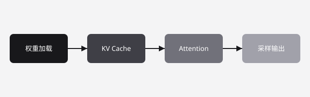

大语言模型推理由「访存密集」主导，与训练的「计算密集」有着本质区别。本文从三个维度梳理最常见的瓶颈。

## 1. 显存带宽：第一瓶颈

推理阶段每个 token 都要完整读取一遍权重。以 70B 参数、FP16 精度为例，权重约 140GB，即便 H100 拥有 3.35TB/s 的带宽，单 token 的下限也接近 42ms。**带宽而不是 FLOPS，决定了首字延迟与吞吐的上限。**

## 2. 算子效率

- **Attention**：长序列下 KV Cache 带来的访存压力随序列长度线性增长。
- **GEMM**：小 batch 时矩阵维度不规整，难以喂饱 Tensor Core。
- **量化**：INT8/FP8 可显著降带宽压力，是当前最有效的优化手段之一。

## 3. 调度与组网

多卡并行时，张量并行对卡间互联（NVLink / 组网）延迟极其敏感。AllReduce 通信一旦成为串行路径，吞吐立刻掉一个量级。

## 小结

推理优化优先盯带宽：量化 → KV Cache 管理 → 提高 batch 与服务化调度。下一篇文章我会展开组网对多卡推理的影响。



```python
# 一个朴素的解码循环示意
for _ in range(max_tokens):
    logits = model.decode(current, kv_cache)
    next_token = sample(logits)
```

Stay tuned。
