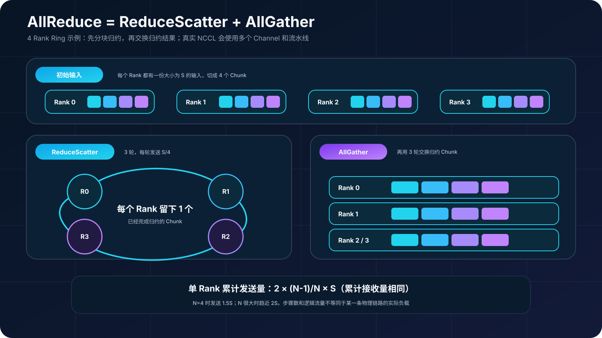
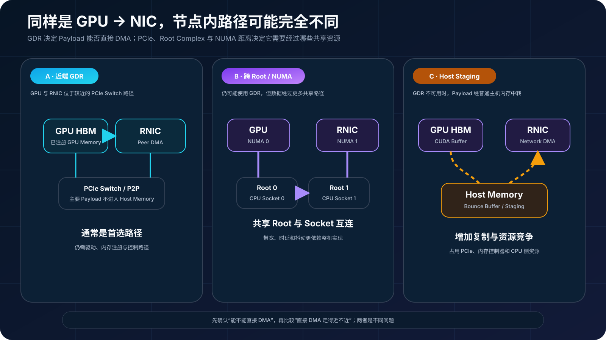
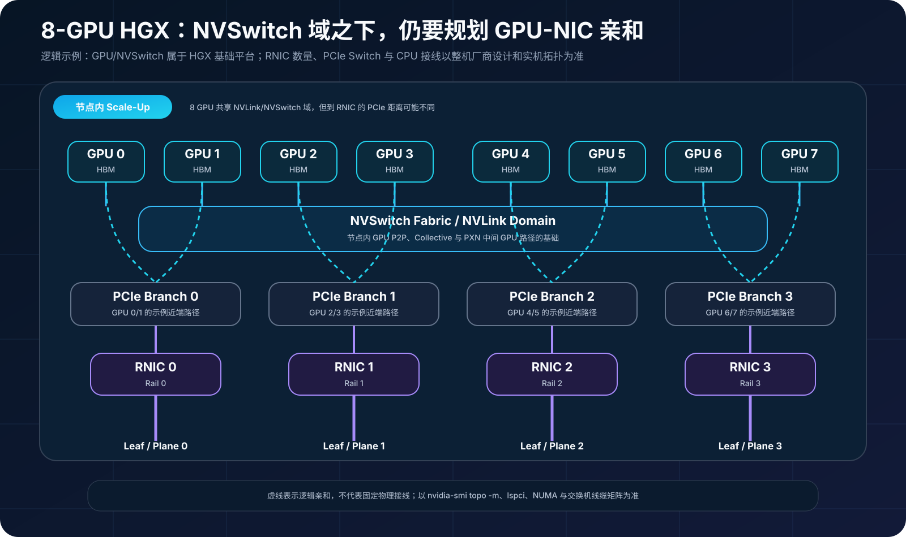
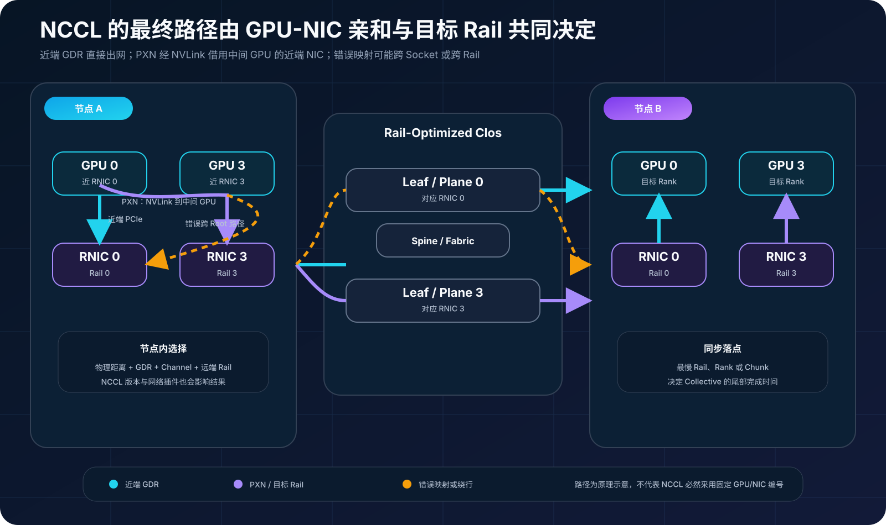

## 0. 前言

前两篇分别梳理了 AI 集群的 Clos 组网和 RDMA 数据路径。这一篇继续向上走一层：训练框架为什么需要集合通信，NCCL 又怎样把一次 AllReduce 映射到 GPU、NVLink、PCIe、RNIC 和 Leaf-Spine 网络上。

本文会重点讨论 GPU 到 NIC 的拓扑。因为交换机端口都是 400G 或 800G，并不代表每张 GPU 都能以同样的代价使用每张 NIC。GPU 与 RNIC 是否位于相近的 PCIe 路径、是否跨 CPU Socket、能否使用 GPUDirect RDMA，以及多个 Rail 是否映射一致，都会影响最终性能。

## 1. 从 Rank 到 AllReduce

在 NCCL 中，Rank 是一个参与通信的执行实体，通常对应一个 CUDA Device。一个包含 `N` 个 Rank 的 Communicator 要求所有 Rank 以匹配的顺序、数据量和类型参与同一次 Collective；调用不匹配可能导致挂起、崩溃或数据错误。[NCCL Collective Operations 文档](https://docs.nvidia.com/deeplearning/nccl/user-guide/docs/usage/collectives.html)对此有明确约束。

数据并行训练中，每张 GPU 根据不同样本计算出一份本地梯度。优化器更新参数前，需要把所有 Rank 的梯度求和或求平均，并让每个 Rank 得到相同结果，这就是 AllReduce。

一种容易理解但效率不高的做法是：先把所有数据 Gather 到一个根节点完成 Reduce，再 Broadcast 给其他 Rank。根节点会成为带宽和计算热点。高性能实现通常把 AllReduce 拆成两个阶段：

1. **ReduceScatter**：数据被分块，每个 Rank 最终保留一个已经完成归约的分块；
2. **AllGather**：所有 Rank 交换这些归约后的分块，最终每个 Rank 都得到完整结果。



### 1.1 Ring 的通信量

假设每个 Rank 的输入数据量为 `S`，一共有 `N` 个 Rank。Ring ReduceScatter 需要 `N-1` 轮，每轮每个 Rank 发送和接收一个大小约为 `S/N` 的分块。按单 Rank 的累计发送量计算（累计接收量相同）：

```text
ReduceScatter = (N-1)/N × S
AllGather     = (N-1)/N × S
AllReduce     = 2 × (N-1)/N × S
```

当 `N` 很大时，单 Rank 的累计发送量趋近 `2S`，累计接收量也相同，而不是向每个其他 Rank 各发送一整份 `S`。Ring 能让各 Rank 持续参与收发，适合用流水线和多个 Channel 利用大消息带宽；代价是逻辑步骤数随 Rank 数量线性增长。

### 1.2 Ring 与 Tree 不是固定二选一

Tree 通过分层聚合和分发，把关键路径的阶段数降到近似对数级，通常更有利于降低小消息或大规模场景中的启动时延；Ring 更容易持续占满链路，通常在大消息下具有良好的带宽效率。但这不是固定规则：实际选择还受 GPU 架构、节点数、消息大小、拓扑、协议和网络插件影响。

当前 NCCL 还可能使用 CollNet、NVLS、NVLSTree、PAT 等算法或硬件辅助能力。默认情况下，NCCL 根据平台和拓扑自动选择，不应仅凭经验在生产环境长期固定 `NCCL_ALGO` 或 `NCCL_PROTO`。[NCCL 环境变量文档](https://docs.nvidia.com/deeplearning/nccl/user-guide/docs/env.html#nccl-algo)也提示，强制协议主要适合实验和问题隔离，错误启用不受支持的协议甚至可能造成数据错误。

## 2. GPU 到 NIC 之间到底经过了什么

跨节点通信并不是简单的“GPU 把数据交给网卡”。一条路径可能经过 GPU HBM、GPU PCIe Endpoint、一个或多个 PCIe Switch、CPU Root Complex、NUMA 互连和 RNIC。即使两张 NIC 的端口速率相同，它们与某张 GPU 的拓扑距离也可能完全不同。



### 2.1 近端 GPUDirect RDMA

在硬件、驱动和内存注册机制均支持时，GPUDirect RDMA（GDR）允许 RNIC 对 GPU Memory 执行 DMA，数据无需先复制到普通 Host Memory。理想路径是 GPU 与 RNIC 位于较近的 PCIe Switch 或同一 PCIe 层级，减少 Root Complex 和 Socket 间互连上的竞争。

“使用 GDR”不等于完全没有 CPU：连接建立、内存注册、控制消息、Proxy 线程和异常处理仍可能需要 CPU。它描述的是主要 Payload 可以绕过 Host Staging，而不是整个通信栈脱离主机软件。

### 2.2 跨 Root Complex 或跨 NUMA

GPU 与 RNIC 不在同一 PCIe 分支时，Peer-to-Peer 流量可能上行到 Root Complex；若设备分属不同 CPU Socket，还可能穿过 UPI、Infinity Fabric 等 Socket 间互连。这条路径不一定不可用，但会与 CPU 内存访问和其他 I/O 共享带宽，时延及抖动也通常更难预测。

### 2.3 Host Staging

如果 GDR 不可用，网络 Payload 通常需要在 GPU Memory 与 Host Memory 之间中转，再由 RNIC 发送。这样不仅增加一次或多次复制，还会占用 PCIe、内存控制器和 CPU 侧资源。Linux 裸机场景中的 IOMMU/ACS 配置也可能把原本的 PCIe Peer-to-Peer 流量重定向到 Root Complex，引起性能下降甚至通信异常；应结合平台指南验证，而不是盲目修改固件。[NCCL GPU 排障文档](https://docs.nvidia.com/deeplearning/nccl/user-guide/docs/troubleshooting/gpu_troubleshooting.html)给出了 P2P、DMA-BUF、`nvidia-peermem`、IOMMU 和 ACS 的检查方法。

## 3. 怎样读懂 GPU-NIC 拓扑

`nvidia-smi topo -m` 是第一张地图，但不能只看 GPU 之间的 NVLink。矩阵通常还会列出 GPU 到 NIC 的关系及 CPU/NUMA Affinity。常见距离标识可以这样理解：

| 标识 | 含义 | 工程关注点 |
| --- | --- | --- |
| `NV#` | 经过若干条 NVLink | GPU 间高带宽路径，具体代际与条数以平台为准 |
| `PIX` | 最多经过一个 PCIe Bridge | 通常是较近的 PCIe P2P 路径 |
| `PXB` | 经过多个 PCIe Bridge，但不经过 Host Bridge | 仍在 PCIe Switch 树内 |
| `PHB` | 经过 PCIe Host Bridge / Root Complex | 可能竞争 Root Complex 带宽 |
| `NODE` | 跨同一 NUMA Node 内的 Host Bridge | 比单一 PHB 更远 |
| `SYS` | 跨 NUMA Node 和 Socket 间互连 | 通常是最需要避免的 GPU-NIC 路径 |

这些标签表示拓扑关系，不是固定带宽值。不同 GPU、PCIe 代际、固件和服务器设计不能仅凭 `PIX < PXB < PHB < SYS` 推导出准确吞吐，仍需实测。

建议按下面的顺序建立设备映射：

```bash
nvidia-smi topo -m
nvidia-smi topo -p2p n
lspci -tv
ibdev2netdev
rdma link show
cat /sys/class/infiniband/<rdma-device>/device/numa_node
cat /sys/class/net/<netdev>/device/numa_node
numactl -H
```

最终至少要得到一张 `GPU → PCIe 路径 → RNIC/HCA → netdev → NUMA → 交换机端口 → Rail` 的映射表。设备编号只是操作系统枚举结果，`GPU3` 和 `mlx5_3` 数字相同并不代表天然亲和。

## 4. 典型 8-GPU HGX 节点与多 Rail

HGX 平台通常提供 8 张 GPU 和 NVSwitch 组成的节点内 NVLink 域，但 HGX 基础板并不替整机定义所有 RNIC、PCIe Switch 和 CPU 的接线。不同 OEM 服务器可能使用不同数量、速率和 PCIe 位置的 NIC。因此，下图是一种便于理解的逻辑模型，不是某个型号的布线承诺。



图中每组 GPU 都有首选 RNIC，但“首选”不是排他关系。NCCL 会结合节点内 NVLink、PCIe 距离、可用 NIC、Channel 和远端拓扑搜索通信图。多 Rail 的目标是让不同节点中逻辑位置对应的 NIC 进入同一网络平面，使大部分流量沿对称路径传输并并行利用多张网卡。

如果某个 Rail 带宽下降、MTU 或拥塞配置不一致，Collective 不会只损失这一条链路的局部性能。同步算法必须等待最慢的数据块或 Rank，尾部延迟会向整个作业传播。

## 5. NCCL 怎样选择 GPU 到 NIC 的路径

### 5.1 本地 NIC 与 GDR

NCCL 会检测 GPU、PCIe、CPU 和网络设备拓扑，并在条件允许时启用 GDR。`NCCL_NET_GDR_LEVEL` 可以限制允许使用 GDR 的最大拓扑距离，例如 `PIX`、`PXB`、`PHB` 或 `SYS`；默认未设置时，由 NCCL 根据架构和环境选择。这个变量适合受控对比，不应脱离实测直接设成“越远越好”。

### 5.2 PXN：借邻近 GPU 使用非本地 NIC

当目标 Rail 对应的 NIC 并不靠近当前 GPU 时，NCCL 可以在支持的平台上使用 PXN（PCI × NVLink）：源 GPU 先通过 NVLink 把数据写到一张更靠近目标 NIC 的中间 GPU，再由该 NIC 经 PCIe 发出。这样可以避免 Payload 穿过较慢的 Socket 间路径，并有机会聚合发往相同远端 NIC 的消息。

PXN 不是“GPU 绕路一定更快”，也不是所有平台和 Collective 都会以同样方式使用。它要求合适的 NVLink/NVSwitch、GPU Peer Access、NIC 可达性及 NCCL 版本。`NCCL_PXN_DISABLE=1` 可以用于对照实验，不建议仅为了让拓扑看起来简单而长期关闭。[NVIDIA PXN 说明](https://developer.nvidia.com/blog/doubling-all2all-performance-with-nvidia-collective-communication-library-2-12/)和 [NCCL 环境变量文档](https://docs.nvidia.com/deeplearning/nccl/user-guide/docs/env.html#nccl-pxn-disable)分别解释了数据路径与控制开关。



### 5.3 物理拓扑不等于最终通信图

`nvidia-smi topo -m` 展示硬件距离，NCCL 还会基于这些距离构造 Ring、Tree、Channel 和网络设备映射。最终路径还会受到可见 GPU 集合、进程绑定、容器设备映射、网络插件和 NCCL 版本影响。因此排障时既要看物理拓扑，也要看 NCCL 实际选择结果。

## 6. 用 nccl-tests 验证，而不是只看架构图

### 6.1 建立单节点与双节点基线

[NVIDIA/nccl-tests](https://github.com/NVIDIA/nccl-tests)可以同时检查 Collective 正确性与性能。先在单节点验证 NVLink/PCIe，再扩展到多节点，避免把节点内问题误判成 Fabric 问题。

```bash
# 单节点 8 GPU：扫描 8 B 到 1 GiB
./build/all_reduce_perf -b 8 -e 1G -f 2 -g 8 -w 5 -n 20

# 2 节点、每节点 8 个 MPI Rank、每 Rank 1 GPU
mpirun -np 16 -N 8 \
  -x NCCL_DEBUG=INFO \
  -x NCCL_DEBUG_SUBSYS=INIT,GRAPH,NET,TUNING \
  ./build/all_reduce_perf_mpi -b 8 -e 1G -f 2 -g 1 -w 5 -n 20
```

MPI 的主机列表、SSH、进程绑定和环境变量转发方式取决于实际 MPI 实现。测试前应确认每个 Rank 绑定到唯一 GPU，并记录 NCCL、CUDA、驱动、固件和网络插件版本。

上面的多节点命令假设按照 nccl-tests README 使用 `MPI=1 NAME_SUFFIX=_mpi` 构建；如果没有使用后缀，或构建产物名称不同，应替换为本机实际的可执行文件名。

### 6.2 `algbw` 与 `busbw` 怎么看

nccl-tests 定义：

```text
algbw = 数据量 S / 完成时间 t

Ring/点对点模型下的 AllReduce：
busbw = algbw × 2 × (N-1)/N
```

`algbw` 更适合回答“一份大小为 S 的梯度完成 AllReduce 要多久”；`busbw` 通过 Collective 理论流量因子修正，便于在传统点对点模型下与硬件传输能力比较。[nccl-tests 性能说明](https://github.com/NVIDIA/nccl-tests/blob/master/doc/PERFORMANCE.md)给出了各 Collective 的公式。

但 `busbw` 不是交换机端口、单张 NIC 或某条 NVLink 的直接实测值。分层算法、NVLS、SHARP 或多 Rail 会改变数据经过物理链路的方式，此时 `busbw` 更接近“按传统点对点模型换算后的带宽”。分析跨节点性能时，还要同时观察每张 NIC 的吞吐、GPU PCIe/NVLink 计数、交换机端口以及最慢 Rank。

### 6.3 记录 NCCL 实际选择

```bash
export NCCL_DEBUG=INFO
export NCCL_DEBUG_SUBSYS=INIT,GRAPH,NET,TUNING
export NCCL_DEBUG_FILE=/tmp/nccl.%h.%p.log
export NCCL_TOPO_DUMP_FILE=/tmp/nccl-topology.xml
```

`GRAPH` 用于观察拓扑检测和图搜索，`NET` 用于观察网络设备与路径，`TUNING` 有助于理解算法和协议选择。多进程写日志时必须使用包含主机名和 PID 的唯一文件名，避免互相覆盖；拓扑 XML 也应在受控单进程初始化或为不同进程设置独立路径时采集。

### 6.4 最少做四组对照

| 对照 | 目的 | 观察重点 |
| --- | --- | --- |
| 单 GPU / 单 NIC → 8 GPU / 多 NIC | 分离端口基线与聚合效率 | 每张 NIC 是否均衡、是否存在慢 Rail |
| GDR 自动选择 → `NCCL_NET_GDR_LEVEL=LOC` | 识别禁用 GDR 后的 Host Staging 成本 | PCIe、CPU 内存带宽、时延与 `algbw` |
| PXN 默认 → `NCCL_PXN_DISABLE=1` | 判断是否借助中间 GPU/NIC | GRAPH/NET 日志、跨 Socket 流量、消息率 |
| 正常多 Rail → 实验室限制单 Rail | 验证故障降级和容量模型 | 作业是否继续、性能下降比例、尾延迟 |

这些变量只适合临时实验。NCCL 官方文档明确提醒，调试类强制参数不应无验证地固化到生产环境；实验结束后应恢复默认自动选择。

## 7. 常见误区

1. **“数字相同的 GPU 和 NIC 就是同一 Rail。”** 编号来自不同子系统，必须用 PCIe、NUMA 和交换机端口映射验证。
2. **“打开 GDR 后，任意 GPU 都能等价地使用任意 NIC。”** GDR 解决是否能够直接 DMA，拓扑距离仍决定数据经过哪些 PCIe 与 Socket 资源。
3. **“NVSwitch 会自动解决所有 GPU-NIC 亲和问题。”** NVSwitch 提供强大的 GPU 间路径，但 NIC 的 PCIe 落点、PXN 可用性和网络 Rail 仍需正确设计。
4. **“`busbw` 达到端口速率就说明网络没有问题。”** `busbw` 是 Collective 换算指标，不能替代逐 NIC、逐 Rail 和交换机遥测。
5. **“所有 Rank 的平均带宽正常就够了。”** 同步 Collective 的完成时间受最慢 Rank 和最慢分块影响，P99/P999 抖动同样重要。

## 结语

AllReduce 的公式解释了理论通信量，GPU-NIC 拓扑则决定这些数据实际走哪条路。对多 GPU、多 NIC 节点而言，真正的数据路径可能是近端 PCIe GDR，也可能跨 Root Complex、经 Host Memory 中转，或者通过 PXN 先走 NVLink 再从另一张 GPU 的近端 NIC 出网。

因此，AI 网络优化不能停在交换机和光模块层面。需要把 GPU、NVLink/NVSwitch、PCIe、NUMA、RNIC、Rail 和 Clos Fabric 放进同一张图，再用 NCCL 日志、nccl-tests 和逐层遥测验证。只有物理拓扑、NCCL 通信图和网络路径彼此一致，纸面带宽才有机会变成训练任务能够使用的有效带宽。
