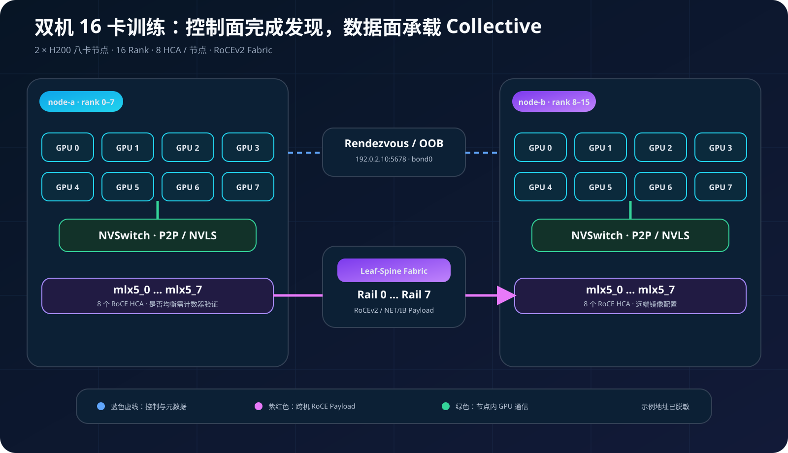
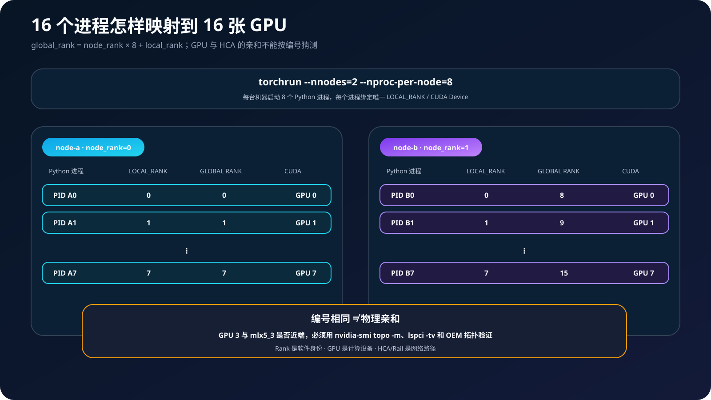
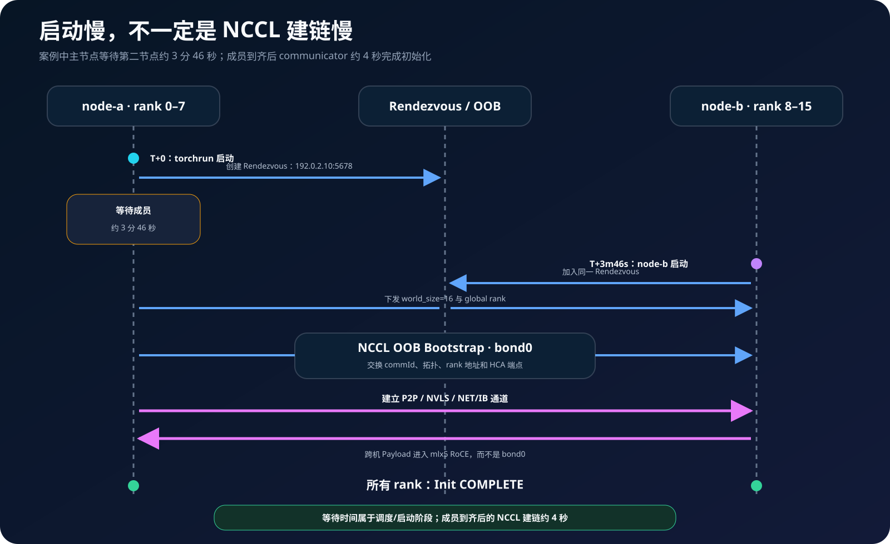
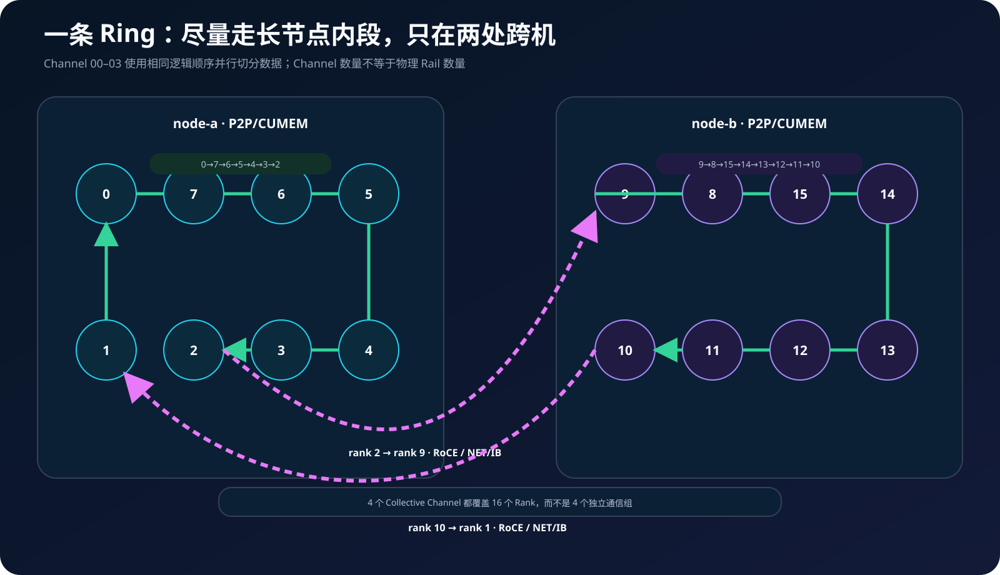
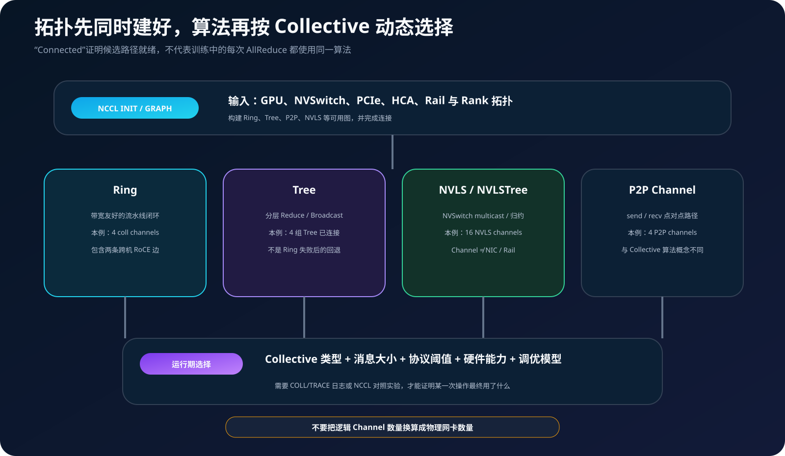
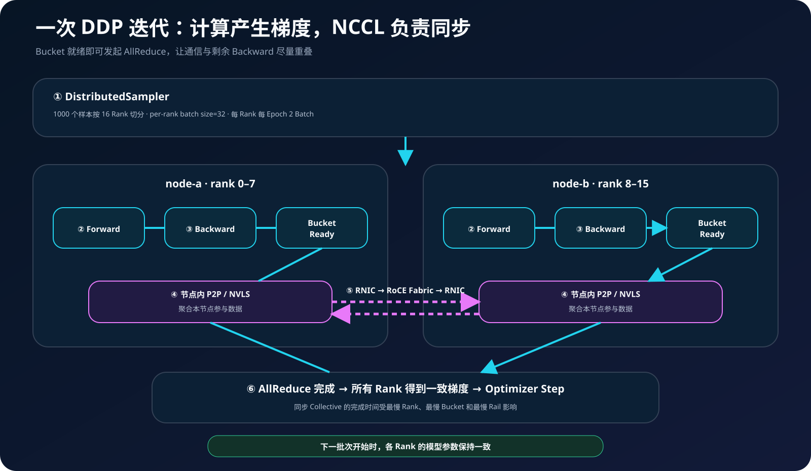

## 0. 前言

前几篇分别讨论了 RDMA、NCCL AllReduce、GPU-NIC 拓扑和 RoCEv2 网络建设。这一篇不再单独讲某个组件，而是把它们装进一次真实的双机训练：两台八卡 H200 服务器怎样拉起 16 个进程，NCCL 怎样发现 GPU 与网卡、建立通信拓扑，梯度又怎样从一张 GPU 走到另一台机器。

本文依据一组实际作业日志整理。主机名、地址和作业编号均已脱敏；日志中没有直接证据的结论会标注为“推断”或“待验证”。

文中的日志片段均来自同一次作业。为了可读性，删除了平台前缀、PID、communicator 内存地址及大量重复的逐 rank 输出，仅保留能够证明阶段转换和数据路径的关键行；`node-a`、`node-b` 与示例地址不是原始生产标识。

## 1. 案例环境与最终结论

先把本次案例压缩成一张表：

| 项目 | 案例配置与日志结果 |
| --- | --- |
| 训练规模 | 2 节点 × 8 张 NVIDIA H200，共 16 个进程、16 个 global rank |
| 节点映射 | `node-a` 为 node rank 0、global rank 0–7；`node-b` 为 node rank 1、global rank 8–15 |
| Rendezvous | `192.0.2.10:5678`，用于 torchrun 进程集合 |
| NCCL Bootstrap | 两端使用 `bond0` 交换 communicator 和网络端点信息 |
| 跨机数据面 | 8 个 `mlx5_0…mlx5_7` RoCE HCA，案例使用 RoCEv2 GID index 3 |
| 节点内数据面 | `P2P/CUMEM`；Hopper NVSwitch 平台的 NVLS 能力可用并已建链 |
| NCCL | 2.19.3 + CUDA 12.3；4 个 collective channel、16 个 NVLS channel、4 个 P2P channel |
| 训练 | `Linear(10, 2)`，1000 个样本，per-rank batch size 32，共 1000 epoch |
| 结果 | 16 个 rank 均完成初始化，1000/1000 epoch 完成，两端进程退出码均为 0 |



结论很明确：本次任务完成了 torchrun 组网、NCCL 初始化、RoCE 跨机建链、节点内 P2P/NVLS 拓扑构建和 DDP 训练。训练结束后出现的 `Abort COMPLETE` 属于 communicator 回收路径，结合它出现的时间和最终退出码，不能把它单独当成训练失败。

但这不是性能基准。示例模型只有 `10×2+2=22` 个 FP32 参数，裸梯度只有 `22×4=88` 字节。它适合验证 16-rank 功能链路，不足以压满 H200、NVSwitch 或八路 RoCE 网络。

## 2. Rank、GPU、HCA 和两张网络

torchrun 在每台机器拉起 8 个 Python 进程，每个进程绑定一张本地 GPU：

```text
global_rank = node_rank × nproc_per_node + local_rank
```

因此 `node-a` 的 local rank 0–7 对应 global rank 0–7，`node-b` 的 local rank 0–7 对应 global rank 8–15。数字只表达进程编号关系；`GPU3` 是否应使用 `mlx5_3`，必须由 PCIe、NUMA 和 NVLink 拓扑证明，不能按编号直接配对。



这个案例同时存在三类通道：

| 通道 | 作用 | 案例中的路径 |
| --- | --- | --- |
| torchrun Rendezvous | 让所有进程汇合并形成 16-rank 进程组 | `192.0.2.10:5678` |
| NCCL Bootstrap / OOB | 交换 communicator ID、rank 地址、拓扑和连接元数据 | `bond0` |
| NCCL Payload | 传输梯度和 collective 数据 | 节点内 P2P/NVLS，节点间 mlx5 RoCE |

控制面和数据面必须分开理解。看到 `Bootstrap : Using bond0`，只能证明 NCCL 使用 bond0 完成带外信息交换，不能据此判断梯度走普通 TCP。后续 HCA 枚举和 `NET/IB` 建链日志才是跨机 RDMA 数据面的证据。

## 3. 从 torchrun 到 16 个进程完成集合

两台机器运行同一份脚本，只有 `node_rank` 不同：

```bash
# node-a
torchrun --nproc-per-node=8 \
  --nnodes=2 \
  --node-rank=0 \
  --master-addr=192.0.2.10 \
  --master-port=5678 \
  /workspace/train.py

# node-b
torchrun --nproc-per-node=8 \
  --nnodes=2 \
  --node-rank=1 \
  --master-addr=192.0.2.10 \
  --master-port=5678 \
  /workspace/train.py
```

案例中 `node-a` 比 `node-b` 早约 3 分 46 秒启动。这段时间主要是主节点等待第二台机器进入 Rendezvous，不是 NCCL 花了几分钟建 RoCE 连接。第二节点到位后，16 个进程在数秒内完成 rank 初始化和 communicator 建链。

torchrun 默认提醒把 `OMP_NUM_THREADS` 设为 1，是为了避免每节点 8 个训练进程同时扩大 CPU 线程池。它是安全起点，不是性能最优值；数据加载、CPU 算子和 NUMA 绑定仍需单独测试。[PyTorch torchrun 文档](https://docs.pytorch.org/docs/stable/elastic/run.html)说明了多节点进程启动和 `LOCAL_RANK` 等环境变量的语义。

下面是两端实际启动和 16-rank 进程组形成时的核心日志。主节点从 `17:03:47` 等到 `17:07:33`，第二节点到位后，rank 0–15 很快全部进入初始化：

```text
[17:03:47] [node-a] torchrun --nproc_per_node 8 --master_addr 192.0.2.10 \
                       --master_port 5678 --nnodes 2 --node_rank 0 train.py
[17:07:33] [node-b] torchrun --nproc_per_node 8 --master_addr 192.0.2.10 \
                       --master_port 5678 --nnodes 2 --node_rank 1 train.py

[17:07:36] [node-a] [启动] 分布式训练开始 | 总进程数: 16 | 设备数量: 16
[17:07:36] [node-a] [配置] batch_size=32 | epochs=1000 | lr=0.001
[17:07:36] [node-a] [进程] rank=0  初始化完成
[17:07:37] [node-b] [进程] rank=8  初始化完成
[17:07:37] [node-b] [进程] rank=15 初始化完成
```

这里只展示首尾几个 rank；原日志中 node-a 的 rank 0–7 和 node-b 的 rank 8–15 均有进程初始化记录。



## 4. NCCL Bootstrap 与 RoCE 设备发现

`dist.init_process_group(backend="nccl")` 之后，各 rank 开始建立 NCCL communicator。日志呈现出下面的顺序：

1. 使用 bond0 完成 OOB Bootstrap；
2. 尝试加载外部 `libnccl-net.so`；
3. 插件不存在时回退到 NCCL 内置网络实现；
4. 枚举 `mlx5_0…mlx5_7`，识别其 RoCE 链路；
5. 为 Ring、Tree、P2P 和 NVLS 准备连接；
6. 所有本地 rank 输出 `Init COMPLETE`。

案例中的关键配置如下：

| 参数 | 案例值 | 正确理解 |
| --- | --- | --- |
| `NCCL_SOCKET_IFNAME` | `bond0` | 指定 NCCL Socket/OOB 使用的接口 |
| `NCCL_IB_DISABLE` | `0` | 允许使用 NCCL 的 IB verbs/RDMA transport |
| `NCCL_IB_HCA` | `=mlx5_0…mlx5_7` | 精确选择 8 个 HCA，等号表示精确匹配 |
| `NCCL_IB_GID_INDEX` | `3` | NCCL 2.19 案例中选择对应的 RoCEv2 GID 表项 |
| `NCCL_IB_QPS_PER_CONNECTION` | `8` | 每连接使用多个 QP，增加路径散列机会 |
| `NCCL_IB_TC` | `186` | Traffic Class 必须与交换机 QoS/ECN/PFC 映射一致 |
| `NCCL_PXN_DISABLE` | `0` | 不禁用 PXN，是否实际采用仍由拓扑和 NCCL 决定 |
| `NCCL_NET_GDR_LEVEL` | `LOC` | 禁用 GPUDirect RDMA；这在本案例中是较保守的限制，需通过 A/B 测试确认是否符合预期 |

这里有两个容易踩坑的版本差异：

- 日志中的 `Using network IB` 是 NCCL 对 IB verbs/RDMA 后端的命名；设备行已经标注 RoCE，因此不能把它解释成原生 InfiniBand Fabric。
- 本案例使用 NCCL 2.19.3，需要显式选择 GID index；NCCL 官方排障文档指出，2.21 及以后版本会动态选择 GID，不应机械复制旧版本的 `NCCL_IB_GID_INDEX=3`。[NCCL Networking Troubleshooting](https://docs.nvidia.com/deeplearning/nccl/user-guide/docs/troubleshooting/networking_troubleshooting.html)也建议根据实际版本和 `show_gids` 结果处理 RoCE GID。

外部 net plugin 缺失也不等于回退 TCP。本案例在插件加载失败后仍成功枚举 RoCE HCA 并建立 `NET/IB` 通道，说明使用的是内置 RDMA 实现。只有平台明确要求特定外部插件时，这条日志才代表部署偏差。

把原日志压缩后，Bootstrap、插件回退、版本和 RoCE HCA 发现可以用四行串起来：

```text
[17:07:37] [node-a rank 0] NCCL INFO Bootstrap : Using bond0:192.0.2.10<0>
[17:07:37] [node-a rank 0] NCCL INFO No plugin found (libnccl-net.so), using internal implementation
[17:07:37] NCCL version 2.19.3+cuda12.3
[17:07:37] [node-a rank 0] NCCL INFO NET/IB : Using [0]mlx5_0:1/RoCE ... [7]mlx5_7:1/RoCE [RO]
[17:07:37] [node-a rank 0] NCCL INFO Using network IB
```

第一行只描述 OOB 接口；第四行才确认 8 个 HCA 的链路类型是 RoCE。日志中的 `[RO]` 表示 PCIe Relaxed Ordering 路径状态，不是 RoCE 的缩写。

## 5. Ring、Tree、P2P 与 NVLS 怎样拼起来

NCCL 初始化不会只建立一条路径。本次日志同时确认：

- 4 个 collective channel 的 Ring 已连接；
- 4 组 Tree 已连接；
- 4 个 P2P channel 已建立，每个 peer 配置 2 个 P2P channel；
- 每节点 8 个 NVLS head 可用，16 个 NVLS channel 已连接。

### 5.1 一条跨越两台机器的 Ring

4 个 collective channel 使用相同的 16-rank 逻辑顺序：

```text
0 → 7 → 6 → 5 → 4 → 3 → 2 → 9 → 8
  → 15 → 14 → 13 → 12 → 11 → 10 → 1 → 0
```

其中 `0→7→…→2` 和 `9→8→…→10` 是节点内 P2P 段；`2→9` 与 `10→1` 是两条跨节点 RoCE 边。这个排列尽量延长节点内高速路径，只在闭环必要位置跨 Fabric。



4 个 Channel 复制同一逻辑顺序，是为了并行切分通信工作，不是把 16 个 rank 分成 4 个互不通信的小组，也不代表存在 4 条物理 Ring 线缆。

原日志直接给出了四个 Channel 的完整顺序，并能在两端找到跨机边的发送与接收镜像：

```text
[17:07:39] [node-a rank 0] NCCL INFO Channel 00/04 : 0 7 6 5 4 3 2 9 8 15 14 13 12 11 10 1
[17:07:39] [node-a rank 0] NCCL INFO Channel 01/04 : 0 7 6 5 4 3 2 9 8 15 14 13 12 11 10 1
[17:07:39] [node-a rank 0] NCCL INFO Channel 02/04 : 0 7 6 5 4 3 2 9 8 15 14 13 12 11 10 1
[17:07:39] [node-a rank 0] NCCL INFO Channel 03/04 : 0 7 6 5 4 3 2 9 8 15 14 13 12 11 10 1

[17:07:39] [node-a rank 2] NCCL INFO 2[2] -> 9[1] [send]    via NET/IB/0
[17:07:39] [node-b rank 9] NCCL INFO 2[2] -> 9[1] [receive] via NET/IB/0
[17:07:39] [node-b rank 10] NCCL INFO 10[2] -> 1[1] [send]    via NET/IB/0
[17:07:39] [node-a rank 1]  NCCL INFO 10[2] -> 1[1] [receive] via NET/IB/0
```

这里的方括号内是对端 CUDA device 索引。例如全局 rank 9 位于 node-b 的本地 GPU 1，因此写成 `9[1]`。

### 5.2 Tree 和 NVLS 不是 Ring 失败后的回退

Ring、Tree 与 NVLS 可以在初始化阶段同时构建，运行时再根据 collective 类型、消息大小、协议阈值、硬件能力和 NCCL 调优模型选择。仅看到 `Connected all rings`，不能证明每一次 AllReduce 都只运行 Ring；同样，16 个 NVLS channel 也不等于 16 张网卡或 16 条 Rail。



NVLS 是 NVLink SHARP，利用 Hopper 及后续第三代 NVSwitch 系统的 multicast/归约能力加速 collective。`NCCL_NVLS_ENABLE=1` 只说明允许使用并分配 NVLS 资源；本次日志中的 NVLS head 和 channel 连接记录，才是能力被识别并完成建链的直接证据。[NCCL 环境变量文档](https://docs.nvidia.com/deeplearning/nccl/user-guide/docs/env.html#nccl-nvls-enable)给出了 NVLS 的版本与平台约束。

```text
[17:07:39] [node-a rank 0] NCCL INFO NVLS multicast support is available on dev 0
[17:07:39] [node-b rank 8] NCCL INFO NVLS multicast support is available on dev 0
[17:07:39] [node-a] NCCL INFO Connected all rings
[17:07:39] [node-a] NCCL INFO Connected all trees
[17:07:40] [node-a] NCCL INFO Connected NVLS tree

[17:07:40] [node-a rank 0] NCCL INFO 0[0] -> 8[0] [send]    via NET/IB/0
[17:07:40] [node-b rank 8] NCCL INFO 0[0] -> 8[0] [receive] via NET/IB/0
[17:07:40] [node-a rank 0] NCCL INFO rank 0  nranks 16 cudaDev 0 - Init COMPLETE
[17:07:40] [node-b rank 15] NCCL INFO rank 15 nranks 16 cudaDev 7 - Init COMPLETE
```

原日志实际包含全部 16 个 rank 的 `Init COMPLETE`。上面只保留两个端点，避免重复，同时保留了 NVLS head 跨机通道的双端证据。

## 6. 一次 DDP 训练迭代的数据全链路

一次训练迭代可以拆成六步：

1. `DistributedSampler` 按 rank 切分 1000 个样本；每个 rank 每个 epoch 获得约 62–63 个样本。
2. 每个 rank 在自己的 GPU 上执行 Forward，得到本地 loss。
3. autograd 反向生成梯度，DDP Reducer 把参数梯度组织成 bucket。
4. 某个 bucket 就绪后，DDP 发起 NCCL AllReduce，并与剩余反向计算重叠。
5. 节点内通信使用 NCCL 选择的 P2P/NVLS 路径，跨节点边进入 RNIC 和 RoCE Fabric。
6. 所有 rank 得到一致的归约梯度后，各自在本地执行 Optimizer Step，模型副本继续保持一致。



`batch_size=32` 是每个 rank 的 batch size。1000 个样本由 16 个 rank 分摊后，每个 rank 每 epoch 有 2 个 batch，因此 1000 epoch 约产生 2000 次 backward，也就约有 2000 轮梯度同步机会。global batch size 约为 `32×16=512`，最后一个 batch 的实际样本数会因 sampler 补齐和数据集规模而变化。

训练日志只由 global rank 0 打印。截取第一轮和最后两轮，就能看到数据规模、训练确实开始、1000 个 epoch 完成以及最终正常退出：

```text
[17:07:41] [node-a rank 0] [数据] 数据集样本数: 1000 | 每个 epoch 批次数: 2
[17:07:41] [node-a rank 0] [训练] Epoch 1/1000 | Batch 0/2 | Loss: 0.8830
[17:07:41] [node-a rank 0] [训练] Epoch 1/1000 完成 | Average Loss: 0.8604
...
[17:07:43] [node-a rank 0] [训练] Epoch 999/1000 完成 | Average Loss: 0.7026
[17:07:43] [node-a rank 0] [训练] Epoch 1000/1000 | Batch 0/2 | Loss: 0.6893
[17:07:43] [node-a rank 0] [训练] Epoch 1000/1000 完成 | Average Loss: 0.7044
[17:07:43] [node-a rank 0] [完成] 分布式训练结束
```

其他 rank 没有打印 loss 是脚本行为。若任一 rank 没有参与匹配的 AllReduce，其他进程通常会在 collective 处等待或报错；本次所有 epoch 完成且两端退出码为 0，是 16 个 rank 协同完成该功能测试的证据。

下面是一份与案例对应的最小可运行脚本。它只保留 `epochs` 作为唯一训练终止条件，避免原材料中 `epochs` 和 `train_iters` 同时存在却含义不一致：

```python
import argparse
import os

import torch
import torch.distributed as dist
from torch import nn
from torch.nn.parallel import DistributedDataParallel as DDP
from torch.utils.data import DataLoader, TensorDataset
from torch.utils.data.distributed import DistributedSampler


def parse_args():
    parser = argparse.ArgumentParser()
    parser.add_argument("--batch-size", type=int, default=32)
    parser.add_argument("--epochs", type=int, default=1000)
    parser.add_argument("--lr", type=float, default=0.001)
    return parser.parse_args()


def main():
    args = parse_args()
    local_rank = int(os.environ["LOCAL_RANK"])
    torch.cuda.set_device(local_rank)
    dist.init_process_group(backend="nccl")

    rank = dist.get_rank()
    world_size = dist.get_world_size()
    device = torch.device("cuda", local_rank)

    model = DDP(nn.Linear(10, 2).to(device), device_ids=[local_rank])
    optimizer = torch.optim.SGD(model.parameters(), lr=args.lr)
    criterion = nn.CrossEntropyLoss()

    # 让所有 rank 基于同一份确定性样本构造数据集，再由 sampler 分片。
    torch.manual_seed(0)
    dataset = TensorDataset(torch.randn(1000, 10), torch.randint(0, 2, (1000,)))
    sampler = DistributedSampler(dataset, num_replicas=world_size, rank=rank)
    loader = DataLoader(dataset, batch_size=args.batch_size, sampler=sampler)

    for epoch in range(args.epochs):
        sampler.set_epoch(epoch)
        for data, target in loader:
            data, target = data.to(device), target.to(device)
            optimizer.zero_grad(set_to_none=True)
            loss = criterion(model(data), target)
            loss.backward()
            optimizer.step()

        if rank == 0:
            print(f"epoch={epoch + 1}/{args.epochs} loss={loss.item():.4f}")

    dist.destroy_process_group()


if __name__ == "__main__":
    main()
```

[PyTorch DDP 文档](https://docs.pytorch.org/docs/stable/generated/torch.nn.parallel.DistributedDataParallel.html)说明，DDP 会在初始化时同步模型状态，并在反向传播期间通过 collective 同步梯度；它不会自动替应用切分输入，因此仍需要 `DistributedSampler` 等数据分片机制。

## 7. 把双机日志对齐到同一条时间线

| 相对阶段 | node-a | node-b | 可以确认的结论 |
| --- | --- | --- | --- |
| T+0 | node rank 0 启动 torchrun | 尚未启动 | 主节点建立 Rendezvous 并等待成员 |
| T+3m46s | 仍在等待 | node rank 1 启动 | 两节点开始组成 16-rank 进程组 |
| T+3m49s | rank 0–7 初始化 | rank 8–15 初始化 | world size 和全局 rank 范围确定 |
| 随后约 1s | bond0 Bootstrap | bond0 Bootstrap | OOB 信息交换完成，外部 net plugin 回退到内置实现 |
| 随后约 1s | 枚举 mlx5_0–7 | 枚举 mlx5_0–7 | 两端识别 RoCE HCA 和 RDMA transport |
| 随后约 2s | Ring/Tree/P2P/NVLS 建链 | 对端镜像建链 | 代表性跨机边 `2→9`、`10→1` 和 NVLS head `0↔8` 配对 |
| T+约 3m53s | rank 0–7 `Init COMPLETE` | rank 8–15 `Init COMPLETE` | communicator 可以承载 collective，实际建链约 4 秒 |
| 训练阶段 | rank 0 打印 epoch/loss | 参与计算但不打印业务日志 | rank 0 独占日志输出是脚本行为，不代表其他 rank 未训练 |
| 收尾阶段 | 释放 communicator | 释放 communicator | 训练完成后出现 `Abort COMPLETE`，两端最终 ExitCode=0 |

跨节点边可以通过双端日志互证。例如 node-a 记录 rank 2 向 rank 9 发送，node-b 应记录 rank 9 从 rank 2 接收。只有单端日志时，可以确认本端尝试了什么，但不能完整证明远端 HCA 选择、链路状态和负载是否一致。

## 8. 三类容易误判的日志

### 8.1 `Using network IB` 不等于使用 InfiniBand

先看设备 link layer 和 HCA 枚举行。本案例明确识别为 RoCE，`IB` 是 NCCL 网络后端名称。排障时应同时检查 `ibv_devinfo`、`rdma link`、GID 类型和网卡 netdev 映射。

### 8.2 `libnccl-net.so` 缺失不等于退回 TCP

插件缺失后仍出现 RoCE HCA、`NET/IB` 连接和 `Init COMPLETE`，说明 NCCL 内置 RDMA 后端工作正常。若环境本来要求使用 SHARP、云厂商或定制插件，再检查镜像、插件版本和 `LD_LIBRARY_PATH`。

### 8.3 `Abort COMPLETE` 不一定是失败

错误判断必须结合时间顺序和进程状态。本案例中它发生在“分布式训练结束”之后，没有 Python traceback、watchdog timeout 或 remote access error，两端 runner 最终 ExitCode=0，因此应归类为 communicator 清理过程。若它出现在训练中途，或伴随非零退出码和远端错误，则必须回到最早的 WARN/ERROR 查根因。

```text
[17:07:43] [node-a rank 0] [完成] 分布式训练结束
[17:07:44] [node-b rank 15] NCCL INFO rank 15 nranks 16 cudaDev 7 - Abort COMPLETE
[17:07:45] [node-a rank 0]  NCCL INFO rank 0  nranks 16 cudaDev 0 - Abort COMPLETE
[17:07:49] [node-a runner] Exited | ExitCode=0
[17:07:49] [node-b runner] Exited | ExitCode=0
```

因此这里判断成功的依据不是看到 `Abort` 这个词，而是“训练完成 → communicator 回收 → 双端退出码为 0”的完整顺序。

另外，旧的 `NCCL_BLOCKING_WAIT` 已被 PyTorch 的 `TORCH_NCCL_BLOCKING_WAIT` 替代，作业模板应移除废弃变量，避免未来版本行为变化。

## 9. 怎样验证这条链路真的跑得好

功能成功和性能健康是两件事。建议按下面的顺序补齐验证：

### 9.1 先还原物理映射

```bash
nvidia-smi topo -m
lspci -tv
ibdev2netdev
rdma link show
show_gids
```

形成 `GPU → PCIe/NVLink → HCA → netdev → GID → Rail → 交换机端口` 映射表，确认 `NCCL_NET_GDR_LEVEL=LOC` 是否有意禁用了 GDR，以及 8 个 HCA 是否都具备预期的 GPU 亲和关系。

### 9.2 分层做性能测试

1. 单节点运行 nccl-tests，验证 NVLink/NVSwitch 和 P2P 基线；
2. 使用 `ib_write_bw` 对每个 GPU-HCA 组合做 Host Memory 与 GPU Memory 对照；
3. 双节点运行 `all_reduce_perf`，依次比较单 HCA、单 Rail 和 8 HCA；
4. 同时采集每个 mlx5 端口的吞吐、错误、重传、CNP、PFC 和 PCIe 状态；
5. 再扩大消息和持续时间，观察 `busbw`、P99 抖动与 Rail 间偏差。

```bash
mpirun -np 16 -N 8 \
  -x NCCL_DEBUG=INFO \
  -x NCCL_DEBUG_SUBSYS=INIT,GRAPH,NET,COLL \
  ./build/all_reduce_perf -b 8 -e 8G -f 2 -g 1
```

可执行文件名取决于 nccl-tests 的构建方式；有些 MPI 构建会生成带 `_mpi` 后缀的程序。NCCL 官方建议先做 GPU、网络和低层 RDMA 检查，再调整通信参数；新版本还提供初始化阶段的主动诊断能力，但本文案例的 NCCL 2.19 不具备这些后续版本功能。

### 9.3 把观测数据放到同一时间轴

| 层级 | 核心证据 |
| --- | --- |
| 训练 | Step Time、loss、慢 rank、collective duration |
| NCCL | INIT/GRAPH/NET/COLL 日志、算法与协议、channel、超时 |
| GPU/PCIe | NVLink 吞吐、PCIe 速率与宽度、GPU-NIC 亲和 |
| RNIC | 每 Rail 吞吐、包速率、CNP、重传、端口错误 |
| 交换机 | 队列水位、ECN、PFC、丢弃、FEC 和 ECMP 倾斜 |

只有多个 HCA 被枚举，不能证明 8 Rail 已均衡承载流量；只有任务 ExitCode=0，也不能证明没有慢 Rail、Host Staging 或跨 NUMA 绕行。性能结论必须由 nccl-tests、逐端口计数器和拓扑证据共同支持。

## 10. 结语

双机 16 卡训练看起来只是两条 torchrun 命令，背后却至少有三层协作：torchrun 负责进程集合与 rank 编排，NCCL 负责发现硬件并建立多套通信拓扑，RoCE Fabric 负责承载跨节点 Payload。DDP 则在反向传播期间把梯度 bucket 交给 NCCL，让通信与计算尽量重叠。

理解全链路的关键，是始终区分“控制面与数据面”“逻辑 Channel 与物理 Rail”“成功建链与达到性能”。只有把两端日志、GPU-NIC 拓扑、NCCL 通信图和网络计数器放进同一条时间线，才能判断一次训练究竟只是跑通了，还是把 16 张 GPU 和 8 路 RoCE 真正用好了。
