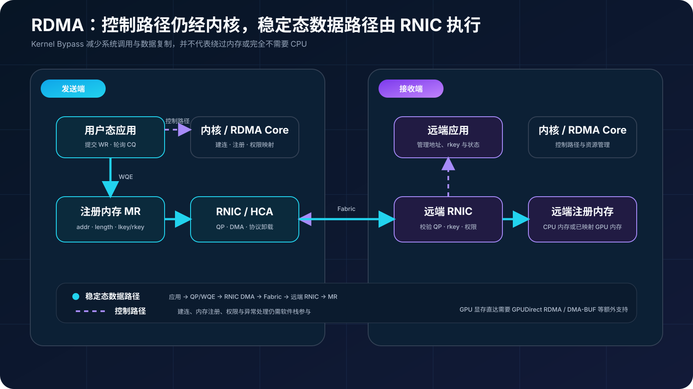
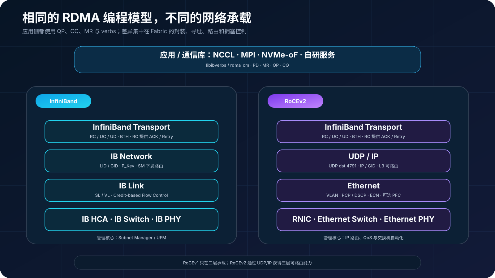
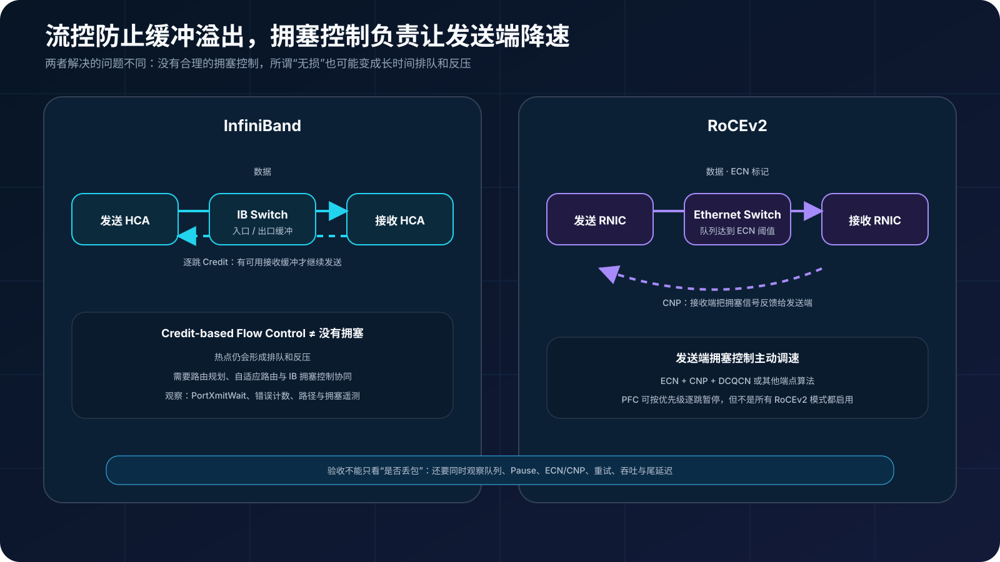
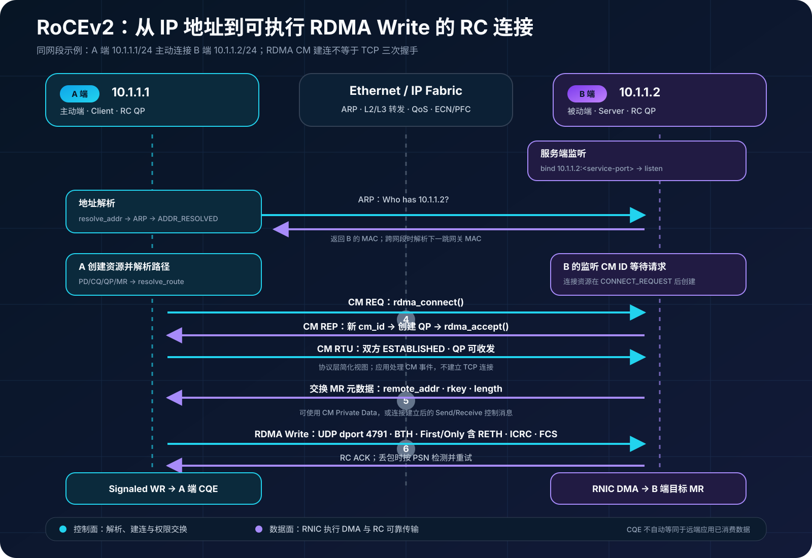

## 0. 前言

上一篇梳理了 AI 集群常见的 Clos 组网，这一篇继续向数据路径深入：GPU 和服务器之间究竟怎样绕开传统内核网络栈，以更低的 CPU 开销完成高速通信？这就绕不开 RDMA，以及目前 AI 集群中最常见的两种承载方式——InfiniBand 和 RoCEv2。

本文先建立 RDMA 的共同模型，再比较两种 Fabric。重点不是简单判断“谁更快”，而是弄清楚它们分别怎样寻址、路由、处理拥塞和恢复异常，以及这些差异会给建设与运维带来什么。

## 1. RDMA 到底改变了什么

传统 Socket 数据路径通常需要经过系统调用、内核协议栈和数据复制。RDMA 则允许应用通过 verbs 接口向 RNIC 提交工作请求，由 RNIC 对已经注册的内存执行 DMA，并通过完成队列通知应用。连接建立、内存注册等控制路径仍然需要内核参与，但稳定态数据传输可以减少系统调用、上下文切换和 CPU 数据搬运。

因此，“RDMA 绕过 CPU 和内存”并不准确。更严谨的说法是：**RDMA 在稳定态数据路径中绕过传统内核网络栈，减少 CPU 参与和中间复制，但数据最终仍然进入本地或远端内存。** 如果目标是 GPU 显存，还需要 GPUDirect RDMA 等额外能力，让 RNIC 通过 PCIe 直接访问 GPU 内存，而不是自动获得“GPU 到 GPU 直传”。[NVIDIA GPUDirect RDMA 文档](https://docs.nvidia.com/cuda/gpudirect-rdma/)也明确说明了 GPU 内存映射、同步和驱动支持要求。



### 1.1 五个核心对象

| 对象 | 全称 | 作用 |
| --- | --- | --- |
| PD | Protection Domain | 隔离和关联 QP、MR 等资源 |
| MR | Memory Region | 注册可被 RNIC DMA 的内存，并生成 lkey/rkey |
| QP | Queue Pair | 由发送队列和接收队列组成，是提交工作的主要通道 |
| CQ | Completion Queue | 保存工作完成或失败的结果 |
| WR/WQE | Work Request / Work Queue Element | 描述一次 Send、Receive、Read、Write 或 Atomic 操作 |

[rdma-core 的内存注册接口](https://github.com/linux-rdma/rdma-core/blob/master/libibverbs/man/ibv_reg_mr.3)显示，MR 会绑定访问权限；本地访问使用 lkey，远端 Read、Write 或 Atomic 则依赖 rkey。rkey 不是普通业务密钥，但它与地址共同构成远端访问能力，不能无边界暴露。

### 1.2 单边与双边操作

- **Send/Receive**：发送方提交 Send，接收方必须提前提交 Receive；双方应用都参与消息语义。
- **RDMA Write**：发送方把本地数据写入远端已授权内存，远端 CPU 不必为每次数据传输提交匹配的 Receive。
- **RDMA Read**：发起方从远端已授权内存读取数据。
- **Atomic**：在硬件支持范围内，对远端内存执行原子比较交换或累加。

“单边”不代表远端完全不参与：连接建立前仍需交换地址、rkey 和业务协议状态，应用也必须自行设计可见性、通知和生命周期管理。

## 2. InfiniBand：从链路到管理都是一套体系

InfiniBand 不只是“能跑 RDMA 的网卡”，而是一套包含链路层、网络层、传输层、交换机、HCA 和管理机制的完整互连架构。

一个 IB 子网中，Subnet Manager（SM）负责发现 Fabric、为端口分配 LID，并计算和下发转发表。业务数据通常根据 LID 在子网内转发；GID 则提供全局标识，可用于跨子网等场景。P_Key 用于分区隔离，Service Level（SL）与 Virtual Lane（VL）参与服务质量和链路资源映射。[NVIDIA RDMA 编程手册](https://docs.nvidia.com/rdma-aware-networks-programming-user-manual-1-7.pdf)对 LID、SM 与路由关系有完整说明。

IB 链路采用基于信用的流控：相邻链路的接收端按 VL 通告可用接收缓冲，发送端拥有足够 Credit 时才继续发送，从机制上避免因为下一跳缓冲耗尽而直接丢包。这里的链路 Credit 不等同于应用在 QP 中投递的 Receive WQE。“链路不丢包”也不等于“不会拥塞”，持续热点仍可能造成排队、反压和头部阻塞，因此大规模网络还需要合理的路由规划、IB 拥塞控制，以及设备支持时的自适应路由。

IB 的典型特点是端到端体系一致、性能行为相对可预测，并有 Subnet Manager/UFM 等专用管理工具。代价是需要专门的 Fabric 运维知识和相应硬件生态。

## 3. RoCEv2：把 RDMA 放到可路由以太网上

RoCE 保留了 RDMA verbs 和 InfiniBand Transport 的核心语义，但把报文承载在以太网上：

- **RoCEv1** 工作在以太网二层，不能跨越普通三层路由边界。
- **RoCEv2** 在外层增加 UDP/IP 封装，默认使用 UDP 目的端口 4791，因此可以通过三层网络路由，并利用 Clos Fabric 的 ECMP。

在应用看来，IB 与 RoCEv2 都可以通过 libibverbs 使用 QP、CQ 和 MR；在网络侧，两者却有完全不同的寻址、路由与拥塞处理方式。



### 3.1 为什么 RoCEv2 对拥塞更敏感

以太网允许交换机在队列溢出时丢包。可靠连接（RC）并非“没有重传”，RNIC 可以检测丢包并重试；问题在于大象流和微突发下，丢包恢复会明显放大时延并降低吞吐，最终拖慢同步式训练任务。

生产 RoCEv2 网络通常围绕以下机制设计：

- **PFC**：按优先级暂停上游发送，保护指定流量类别；它不是整条链路的全局 Pause。
- **ECN**：交换机在队列达到阈值时标记报文，而不是等待队列溢出。
- **CNP**：接收端发现 ECN 标记后向发送端返回拥塞通知。
- **端点拥塞控制**：发送端根据 CNP 调整速率，例如 DCQCN 或设备采用的其他算法。

PFC + ECN 是常见的无损 RoCE 方案，但 PFC 并非 RoCEv2 的绝对前提。部分方案支持不启用 PFC、主要依赖 ECN 与端点拥塞控制的有损模式。NVIDIA 的 [Cumulus Linux RoCE 文档](https://docs.nvidia.com/networking-ethernet-software/cumulus-linux/Layer-1-and-Switch-Ports/Quality-of-Service/RDMA-over-Converged-Ethernet-RoCE/)也分别列出了 lossy 与 lossless 配置：两者都使用 ECN，lossless 模式额外启用 PFC。

### 3.2 PFC 为什么不能“一开了之”

PFC 能降低队列溢出造成的丢包，却可能把拥塞向上游传播。Headroom 不足仍会丢包，阈值过于保守则浪费缓存；不合理的优先级、拓扑依赖和队列设计还可能引起 Pause Storm、Head-of-Line Blocking，甚至 PFC Deadlock。

所以 RoCEv2 的目标不是追求“Pause 越多越安全”，而是让 ECN 和端点拥塞控制尽早起效，把 PFC 作为最后一道保护，并持续观察 Pause、ECN、CNP、队列水位和丢弃计数。



## 4. 一次 RoCEv2 端到端建连是怎样发生的

下面用一条最常见的 RC（Reliable Connection）连接串起前面的概念。假设 A、B 两端的 RoCE 网卡地址分别是 `10.1.1.1/24` 和 `10.1.1.2/24`，处于同一二层子网；B 先监听一个应用约定的 RDMA CM 服务端口，A 主动发起连接。若两端跨三层，ARP 解析的将是下一跳网关 MAC，但后续 RDMA CM 与 QP 建立逻辑基本相同。



整个过程可以分成六个阶段：

1. **B 端进入监听状态**：B 创建 Event Channel 和监听用的 `rdma_cm_id`，调用 `rdma_bind_addr()` 绑定 `10.1.1.2:<service-port>`，再调用 `rdma_listen()`。这个服务端口用于区分应用服务，不等于 RoCEv2 报文外层的 UDP 目的端口 4791。
2. **A 端完成地址解析**：A 调用 `rdma_resolve_addr()`。Linux 根据路由表选择 RoCE netdev、源 IP 和对应的 GID，并在同一子网内通过 ARP 获得 B 的 MAC；成功后产生 `RDMA_CM_EVENT_ADDR_RESOLVED`。
3. **A 端创建资源并解析路径**：地址解析完成后，A 创建 PD、CQ、QP，注册本地 MR，并按业务需要提前投递 Receive；然后调用 `rdma_resolve_route()` 准备到远端的路径信息，成功后产生 `RDMA_CM_EVENT_ROUTE_RESOLVED`。`rdma_create_qp()` 只要求 CM ID 已经绑定到本地 RDMA 设备，因此也可以在路径解析完成后、调用 `rdma_connect()` 前创建；这里采用 rdma-core 手册给出的典型顺序。
4. **RDMA CM 完成握手**：A 调用 `rdma_connect()` 发起连接；B 收到 `RDMA_CM_EVENT_CONNECT_REQUEST` 时会得到一个新的、代表该连接的 `rdma_cm_id`，随后为它创建 PD/CQ/QP、注册 MR、投递必要的 Receive，并调用 `rdma_accept()`。从协议层简化来看，这对应 REQ、REP 和 Ready-to-Use（RTU）的连接建立过程；应用实际处理的是 RDMA CM 事件。成功后两侧收到 `RDMA_CM_EVENT_ESTABLISHED`，关联的 RC QP 进入可收发状态。QP 状态转换及 PSN、重试次数等参数由 RDMA CM、内核驱动和 RNIC 协同配置，不是 TCP 三次握手；监听用的 CM ID 本身也不承载这条连接的数据。
5. **交换远端内存访问元数据**：RDMA Write/Read 还需要远端虚拟地址、rkey 和长度。这些信息可以放在 CM Private Data 中交换，也可以在连接建立后通过 Send/Receive 控制消息交换。rkey 代表访问能力，应当限制权限、范围和生命周期。
6. **进入稳定态数据传输**：A 提交 RDMA Write WQE 后，RNIC 从本地 MR DMA 取数。RoCEv2 报文使用 `Ethernet / IP / UDP / BTH` 封装，RDMA Write First 或 Only 报文还会携带 RETH，末尾包含 ICRC，并由以太网链路添加 FCS；外层 UDP 目的端口为 4791。一次较大的 Write 会按 MTU 分成 First、Middle 和 Last 等多个报文，Middle/Last 不会重复携带 RETH。B 的 RNIC 校验目标 QP、PSN、rkey、地址范围和访问权限后把数据 DMA 到目标 MR，并为 RC 返回 ACK；如果 A 使用 Signaled WR，完成后会在 A 的 CQ 中生成 CQE。这个完成表示本地工作请求达到相应完成语义，并不自动等同于 B 端应用已经消费数据，跨端通知通常还要使用 Write with Immediate、Send/Receive 或应用自己的状态协议。

[rdma-core 的 RDMA CM 手册](https://github.com/linux-rdma/rdma-core/blob/master/librdmacm/man/rdma_cm.7)分别给出了主动端的地址解析、路径解析、连接和 `ESTABLISHED` 事件，以及被动端的绑定、监听、`CONNECT_REQUEST` 和接受流程；[NVIDIA RoCE 文档](https://docs.nvidia.com/doca/archive/2-10-0/RDMA%2Bover%2BConverged%2BEthernet/index.html)则说明了 RDMA CM 如何从 IP 地址选择源 GID，以及 RoCEv2 QP 的模式和地址向量关系。

### 4.1 抓包和排障时应该看什么

建连失败时，不要一开始就归因于“RDMA 不通”，而应按阶段缩小范围：

- 没有 `ADDR_RESOLVED`：检查 IP、路由、ARP/邻居项、netdev 与 GID 表映射；
- 没有 `ROUTE_RESOLVED`：检查两端 RoCE 模式、GID Type、VLAN 和路由选择；
- B 收不到 `CONNECT_REQUEST`：检查监听地址和服务端口、ACL、防火墙以及路径 MTU；
- 收到请求但无法 `ESTABLISHED`：检查 QP 参数、资源上限、Private Data 和两端协议兼容性；
- 已建连但 RDMA Write 失败：检查 MR 权限、地址、rkey、PSN/Retry、PFC/ECN 以及端口错误计数。

抓包中看到 UDP 4791，只能证明捕获到了 RoCEv2 报文，不能单独证明 QP 已成功建立或 RDMA 操作已完成。还应结合 `rdma_cm` 事件、CQE/WC 状态、RNIC 硬件计数器和交换机队列遥测共同判断。

## 5. InfiniBand 与 RoCEv2 怎么选

| 维度 | InfiniBand | RoCEv2 |
| --- | --- | --- |
| 承载网络 | 原生 IB Fabric | 可路由以太网与 UDP/IP |
| 寻址、隔离与 QoS 标识 | LID/GID、P_Key、SL/VL | IP/GID、VLAN/VRF、DSCP/PCP |
| 路由与管理 | SM/UFM 计算并管理路径 | 以太网控制面，常见 BGP/ECMP |
| 链路流控 | 基于信用的链路流控 | 可选择 PFC，也可采用有损模式 |
| 拥塞控制 | IB 拥塞控制；设备支持时可采用自适应路由 | ECN、CNP、端点算法及可选 PFC |
| 运维体系 | 专用工具与 IB 经验 | 可复用 IP/Ethernet 工具，但 QoS 调优要求高 |
| 生态取舍 | 端到端集成度高 | 易与现有以太网体系融合 |

不能简单地说“IB 一定更快、更贵，RoCEv2 一定更慢、更便宜”。性能取决于网卡、交换芯片、速率、拓扑、路由、拥塞控制和软件栈；TCO 还要包含光模块、布线、自动化、监控和运维团队成本。

选择 IB，通常是看重成熟的一体化高性能 Fabric、明确的管理边界和可预测行为；选择 RoCEv2，通常是希望利用标准以太网/IP 生态、三层可路由能力以及现有网络自动化体系。两者都能用于大型 AI 集群：[NVIDIA HGX AI Factory](https://docs.nvidia.com/enterprise-reference-architectures/hgx-ai-factory/latest/network-logical-architecture.html)采用 Rail-Optimized Spectrum-X Ethernet/RoCE 网络，而 [DGX SuperPOD H100](https://docs.nvidia.com/dgx-superpod/reference-architecture-scalable-infrastructure-h100/latest/network-fabrics.html)采用 Rail-Optimized InfiniBand 计算 Fabric。

## 6. 四个常见误区

1. **“RDMA 会绕过内存。”** 不会。RDMA 的核心正是让 RNIC 对注册内存执行 DMA；它减少的是内核数据路径和中间复制。
2. **“RoCEv2 丢包后无法恢复。”** RC 具备可靠传输与重试能力，但丢包恢复成本很高，频繁丢包会严重损害性能。
3. **“RoCEv2 必须启用 PFC。”** 无损模式通常使用 PFC + ECN，但也存在以 ECN 和端点拥塞控制为核心的有损模式。
4. **“RoCEv2 只适合中小集群。”** 集群规模不是协议选择的唯一标准；拓扑、芯片能力、自动化与拥塞控制共同决定可扩展性。

## 7. 从哪些命令开始观察

先在节点上建立设备、端口和协议类型的对应关系：

```bash
ibv_devinfo -v
ibstat
rdma dev show
rdma link show
ip -br address
ethtool -i <netdev>
ethtool -S <netdev>
```

重点查看 `link_layer`、端口状态、速率、MTU、LID/GID、设备与 netdev 映射，以及错误和拥塞计数。IB 环境还可以结合 `sminfo`、`iblinkinfo`、`ibroute` 和 `perfquery` 查看 SM 与 Fabric；RoCEv2 则要继续核对 GID Index、VLAN、DSCP/PCP、PFC、ECN 和交换机队列配置。

双节点基线可以使用 [linux-rdma/perftest](https://github.com/linux-rdma/perftest)。下面以 B 端 `10.1.1.2` 作为服务端为例；`-R` 表示使用 RDMA CM 创建并连接测试 QP：

```bash
# B 端：先启动服务端
ib_write_bw -d <device> -i <port> -x <B-gid-index> -R -D 15 --report_gbits
ib_read_bw  -d <device> -i <port> -x <B-gid-index> -R -D 15 --report_gbits
ib_send_lat -d <device> -i <port> -x <B-gid-index> -R -n 5000

# A 端：使用完全相同的测试类型连接 B 端
ib_write_bw -d <device> -i <port> -x <A-gid-index> -R -D 15 --report_gbits 10.1.1.2
ib_read_bw  -d <device> -i <port> -x <A-gid-index> -R -D 15 --report_gbits 10.1.1.2
ib_send_lat -d <device> -i <port> -x <A-gid-index> -R -n 5000 10.1.1.2
```

每组测试只运行对应的一对命令，不是把六条命令同时执行。两端需要选择地址族和 GID Type 相互兼容的 RoCEv2 GID；GID Index 是各节点本地 GID 表的索引，所以 A、B 两端的数值可能不同。测试类型、消息大小、持续时间、QP 数量等模式相关参数应保持兼容。测试结果要和链路速率、NUMA、MTU 及测试前后的端口计数器一起记录，不能只截取一个峰值数字。

## 结语

InfiniBand 与 RoCEv2 的共同基础是 RDMA verbs、注册内存和 RNIC 队列；真正拉开工程差异的，是下面的 Fabric 如何寻址、路由、流控、反馈拥塞和暴露可观测性。

IB 把这些能力组织在一套原生体系中，RoCEv2 则把 RDMA 带入标准以太网和 IP 网络。理解二者，不应止于“专网还是以太网”的标签，而要沿着数据路径逐层追问：数据落在哪里、谁负责可靠性、拥塞信号如何返回、出现异常时能看到哪些证据。把这些问题回答清楚，才算真正走进 RDMA。
