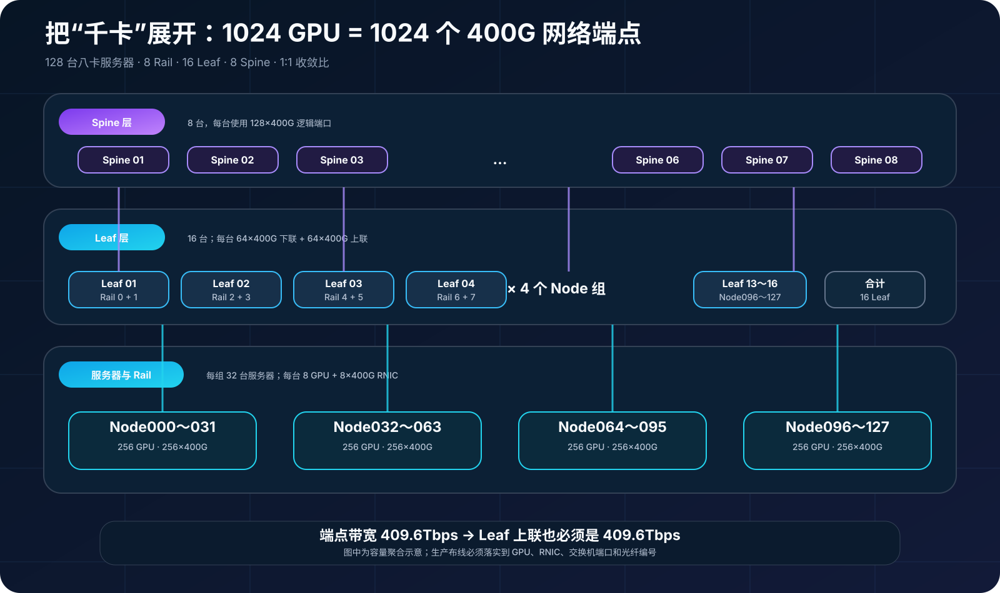
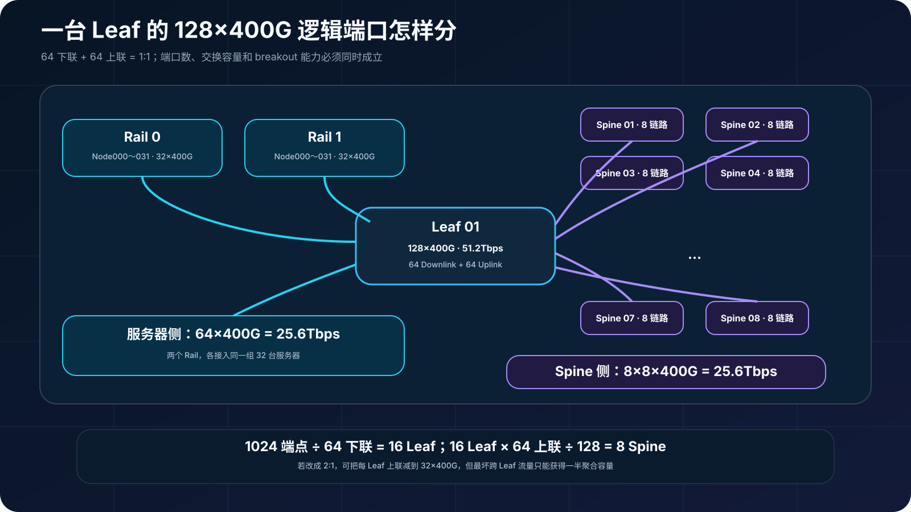
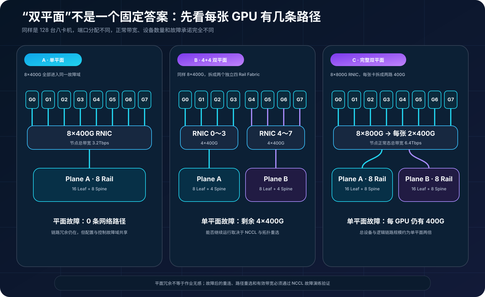
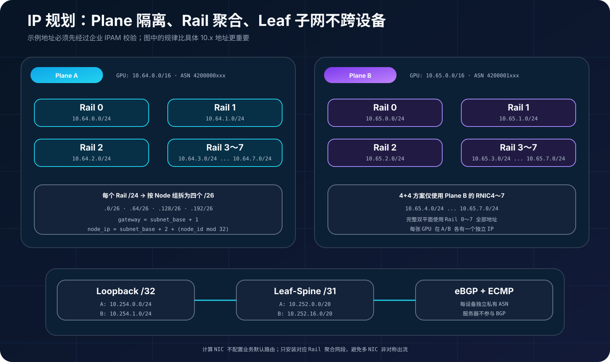

## 0. 前言

前面几篇分别讨论了 Clos、RDMA，以及 NCCL 如何利用 GPU-NIC 拓扑。这一篇开始把这些概念装进一张真正能够计算的网络：128 台八卡服务器、1024 张 GPU，每台服务器有 8 张高速 RNIC，计算网采用 RoCEv2。

目标不是复刻某一台交换机的端口表，而是建立一套可迁移的方法：先确定端点和带宽，再计算 Leaf、Spine、链路与故障域，最后落到 IP、ASN、光模块和验收项。设备型号会变化，计算方法不能跟着失效。

## 1. 先把“千卡”变成端口

本文采用下面的统一算例：

| 项目 | 数值 |
| --- | ---: |
| GPU 数量 | 1024 |
| 服务器数量 | 128 |
| 每台服务器 GPU | 8 |
| 单平面/4+4 方案的 RNIC | 8×400GbE |
| 完整双平面方案的 RNIC | 8×800GbE，拆分为 2×400GbE |
| 交换机端口模型 | 64×800G，可拆为 128×400G |
| 目标收敛比 | 1:1 |

这里的“8 GPU 对应 8 NIC”只描述逻辑亲和，不能用设备编号猜接线。GPU0 是否真的靠近 RNIC0，仍要用 `nvidia-smi topo -m`、`lspci -tv` 和厂商拓扑图确认。



单平面下，每台服务器提供 `8×400G = 3.2Tbps`，128 台服务器一共有：

```text
服务器侧端点 = 128 × 8 = 1024 个 400G 端口
下行总带宽 = 1024 × 400G = 409.6Tbps
```

若要求 1:1，Leaf 到 Spine 也必须提供 409.6Tbps。ECMP、PFC 和大缓存都不能替代这部分物理带宽。

## 2. 交换机数量怎样算出来

以 128 个 400G 逻辑端口的交换机为例，每台 Leaf 使用 64 个端口下联、64 个端口上联：

```text
单台 Leaf 下联容量 = 64 × 400G = 25.6Tbps
单台 Leaf 上联容量 = 64 × 400G = 25.6Tbps
单平面 Leaf 数量  = 1024 / 64 = 16
```

为了保持 Rail 对称，一台 Leaf 可以承载两个 Rail 中各 32 台服务器。例如 Leaf-A01 接入 Node000～Node031 的 Rail0 和 Rail1，一共 64 个 400G 下联。

16 台 Leaf 的每台 Leaf 把 64 条 400G 上联平均分到 8 台 Spine：每个 Leaf-Spine 对之间有 8 条 400G，单台 Spine 最终接收 `16×8=128` 个 400G 逻辑端口，端口恰好用满。因此一个完整单平面需要：

```text
16 Leaf + 8 Spine = 24 台交换机
```



这个结果依赖三个前提：设备能够线速转发 51.2Tbps、800G 端口能够按设计拆分为 2×400G、NOS 与布线支持 Leaf-Spine 间的并行链路。换成 64×400G 设备后必须重新计算，不能只把型号替换掉。

## 3. 三种平面设计

### 3.1 单平面：最直接，但故障域最大

单平面把 8 个 Rail 放进同一个物理 Fabric：16 Leaf、8 Spine。设备和链路最容易统一管理，全部 8×400G 都能被 NCCL 使用。

它的问题不是没有链路冗余。单 Spine 故障后仍有 7 台 Spine，理论上保留 87.5% 上联容量；真正的风险是整个 Fabric 共享控制面、配置变更和拥塞故障域。一次错误的 QoS 模板、路由策略或批量升级可能同时影响全部 Rail。

### 3.2 4+4 双平面：不加端口，拆故障域

4+4 方案把原有 8×400G 分成两个完全独立的 Fabric：

- Plane A：RNIC0～RNIC3，4×400G；
- Plane B：RNIC4～RNIC7，4×400G。

每个平面有 512 个 400G 端点，可使用 8 Leaf + 4 Spine。两个平面合计仍然是 16 Leaf + 8 Spine，服务器链路和 Fabric 链路总数也没有增加。

它的价值是隔离，而不是凭空增加带宽。单个平面不可用时，节点剩余 4×400G；作业能否不中断，还取决于 NCCL、网络插件、GPU-NIC 拓扑和调度系统是否能够重新使用存活的 NIC。不能只凭“有另一个平面”就承诺业务无感。

### 3.3 完整双平面：每张 GPU 都有两条 400G 路径

完整双平面使用 8 张 800G RNIC，每张 RNIC 拆成两个 400G 端口，分别接入 Plane A 和 Plane B。这样每个平面都有完整的 8 Rail 和 8×400G 节点带宽，正常状态下每节点合计 6.4Tbps；单平面失效后仍保留 3.2Tbps。

[NVIDIA HGX AI Factory 参考架构](https://docs.nvidia.com/enterprise-reference-architectures/hgx-ai-factory/latest/network-logical-architecture.html)的 128 节点、1024 GPU 示例采用了这种双平面思路，并给出总计 32 Leaf、16 Spine 的计算网规模。它是本文完整双平面的参考，而不是所有八卡服务器的固定接线。



三种方案的主 BOM 如下，未包含离线备件：

| 方案 | Leaf | Spine | 服务器侧 400G 逻辑链路 | Leaf-Spine 400G 等效链路 | 400G 等效光口端点 |
| --- | ---: | ---: | ---: | ---: | ---: |
| 单平面 | 16 | 8 | 1024 | 1024 | 4096 |
| 4+4 双平面 | 8+8 | 4+4 | 1024 | 512+512 | 4096 |
| 完整双平面 | 16+16 | 8+8 | 2048 | 1024+1024 | 8192 |

“400G 等效光口端点”按每条逻辑链路两端各一个计算，用于比较规模，不等于最终物理模块数量。800G 双口光模块、2×400G breakout、DAC、AOC 和不同距离的光纤方案都会改变真实 SKU 与数量，采购前必须根据线缆矩阵重新展开。

## 4. 一套可以复用的 IP 规划

### 4.1 不跨 Leaf 延伸二层

计算网采用 L3 Clos。每个 Rail 在每组 Leaf 下使用独立的服务器子网，Leaf 之间通过 BGP 发布路由，不为了“地址好看”把同一个 VLAN 跨多台 Leaf 延伸。

本文预留：

| 用途 | Plane A | Plane B |
| --- | --- | --- |
| GPU/RNIC 地址 | `10.64.0.0/16` | `10.65.0.0/16` |
| Loopback | `10.254.0.0/24` | `10.254.1.0/24` |
| Leaf-Spine 互联 | `10.252.0.0/20` | `10.252.16.0/20` |
| 私有 ASN 起点 | `4200000000` | `4200001000` |

这些地址是示例，不是特殊保留地址。落地前必须经过企业 IPAM 校验，避免与现网、容器、存储或 VPN 地址重叠。32 位私有 ASN 的合法范围是 `4200000000～4294967294`，定义见 [RFC 6996](https://www.rfc-editor.org/rfc/rfc6996.html)。

### 4.2 每个 Rail 一个 `/24`，再按 Leaf 切 `/26`

Plane A 的 Rail0 使用 `10.64.0.0/24`，Rail1 使用 `10.64.1.0/24`，依次类推。每个 `/24` 按 32 台服务器一组切成四个 `/26`：

| Node ID | Leaf 组 | Rail0 子网 | 网关 | 节点地址范围 |
| --- | ---: | --- | --- | --- |
| 000～031 | 0 | `10.64.0.0/26` | `10.64.0.1` | `10.64.0.2～10.64.0.33` |
| 032～063 | 1 | `10.64.0.64/26` | `10.64.0.65` | `10.64.0.66～10.64.0.97` |
| 064～095 | 2 | `10.64.0.128/26` | `10.64.0.129` | `10.64.0.130～10.64.0.161` |
| 096～127 | 3 | `10.64.0.192/26` | `10.64.0.193` | `10.64.0.194～10.64.0.225` |

对 Node ID `n`，可以用同一公式生成任意 Rail 的地址：

```text
leaf_group = floor(n / 32)
host_index = n mod 32
subnet_base = leaf_group × 64
gateway = subnet_base + 1
node_ip = subnet_base + 2 + host_index
```

例如 Node037 的 `leaf_group=1`、`host_index=5`，其 Plane A Rail2 地址为 `10.64.2.71/26`，网关为 `10.64.2.65`。

在 4+4 方案中，Plane A 使用 Rail0～3 的 `10.64.0.0/24～10.64.3.0/24`，Plane B 的 RNIC4～7 使用 `10.65.4.0/24～10.65.7.0/24`。完整双平面则在 Plane A 和 Plane B 中都规划 Rail0～7。



### 4.3 服务器路由不要依赖多个默认网关

计算 RNIC 不承载业务默认路由。每个接口只安装到本 Rail 聚合网段的路由，例如 Rail2：

```text
10.64.2.0/24 via <本机 Rail2 网关> dev <Rail2 netdev>
```

NCCL 或网络插件使用各 Rail 的对端地址建立连接。若同一 Linux Network Namespace 中存在多个重叠默认路由，又没有源地址策略路由，数据可能从错误 NIC 发出，引起非对称路径、邻居解析失败或性能抖动。

### 4.4 Leaf-Spine 使用 eBGP 与 ECMP

每台交换机使用独立 32 位私有 ASN。示例编号规则为：

- Plane A Spine：`4200000001～4200000008`；
- Plane A Leaf：`4200000101～4200000116`；
- Plane B Spine：`4200001001～4200001008`；
- Plane B Leaf：`4200001101～4200001116`。

Leaf-Spine 三层互联使用 `/31`。可以给每条独立 routed link 分配 `/31`，也可以在设备和故障模型允许时把同一 Leaf-Spine 对的成员链路组成聚合接口，再给聚合接口一个 `/31`。两种方式的 ECMP 邻接数量和成员故障行为不同，必须在上线前实测。

## 5. 交换机怎样选

本文主模型对应 51.2Tbps、64×800G、可拆 128×400G 的设备类别。[NVIDIA SN5000 硬件手册](https://networking-docs.nvidia.com/sn5000hw/introduction)列出的 SN5600/SN5610 属于这一端口模型；SN5400 为 64×400G、25.6Tbps，不能直接套用本文 24 台交换机的结果。

选型时至少核对：

| 维度 | 必须确认的问题 |
| --- | --- |
| 端口与容量 | 400G/800G 是否线速，breakout 是否受相邻端口限制，FEC 是否匹配 |
| 路由 | eBGP、BFD、ECMP 数量、并行链路和 Resilient Hashing 能力 |
| RoCE | ECN/WRED、PFC、Headroom、PFC Watchdog、队列与 DSCP/PCP 映射 |
| 可观测性 | 队列水位、ECN 标记、PFC Pause、丢弃、光功率与流量分布 |
| 工程条件 | NOS、自动化接口、风道、供电、机框深度、光模块兼容矩阵 |

需要特别注意产品生命周期和具体 SKU。即使同系列设备端口能力相同，电源、风道、操作系统授权和供货状态也可能不同，文章中的型号只能作为技术能力示例。

## 6. RoCEv2 不是把 PFC 打开就结束

RoCEv2 的网络设计至少包含四组联动配置：

1. **分类与队列**：服务器和交换机对 RoCE Payload、CNP 与普通流量使用一致的 DSCP/PCP 和队列映射；
2. **ECN 与端点拥塞控制**：交换机在目标队列达到阈值时标记 ECN，RNIC 通过 DCQCN 或平台指定算法降低发送速率；
3. **PFC 与 Headroom**：若采用无损模式，只在指定优先级启用 PFC，并按端口速率、线缆距离和设备流水线计算 Headroom；
4. **MTU 与 FEC**：端到端 MTU、端口速率、FEC 和 breakout 模式保持一致。

当前 Cumulus Linux 同时支持启用 PFC+ECN 的 RoCE 模式，以及以 ECN 为核心的 lossy 模式，具体选择应以 NIC、交换机和整套方案的认证结果为准。[NVIDIA RoCE 配置指南](https://docs.nvidia.com/networking-ethernet-software/guides/esf-generic-config-guide/)也把缓存、分类、PFC、ECN、队列和端点设置作为一个整体，而不是孤立参数。

2:1 收敛可以把每台 Leaf 的上联从 64×400G 减少到 32×400G，并在本文端口模型下把单平面的 Spine 从 8 台减少到 4 台。但这只适合经过通信矩阵验证的成本方案：微突发、AllReduce 同步流量和最坏跨 Leaf 流量不会因为平均利用率低而消失。

## 7. 上线前怎样验收

建议按照从物理层到 Collective 的顺序验收：

1. **映射核对**：确认 GPU、RNIC、netdev、NUMA、交换机端口、Rail、Plane 和 IPAM 记录完全一致；
2. **物理与三层基线**：检查光功率、FEC、误码、MTU、ARP/ND、BGP、ECMP 和 BFD；
3. **RDMA 单流与多流**：使用 perftest 比较同 Leaf、跨 Leaf、跨 Spine、单 Rail 和多 Rail 的吞吐、时延与重传；
4. **NCCL 实测**：使用 nccl-tests 测 AllReduce、AllGather 和 ReduceScatter，记录 `algbw`、`busbw` 与 P99 抖动；
5. **拥塞观测**：同时采集 ECN、CNP、PFC Pause、PFC Watchdog、队列水位、端口丢弃和每条 ECMP 路径流量；
6. **故障演练**：依次断开单链路、单 Leaf、单 Spine 和整个 Plane，验证路由恢复、剩余容量与作业行为。

双平面验收不能只做 `ping`。4+4 方案在单平面故障后只剩一半 NIC；完整双平面虽然每张 GPU 仍有一条 400G 路径，作业也可能因为连接重建、超时或慢 Rank 发生抖动。是否达到“可降级运行”必须由故障注入和 NCCL 结果证明。

## 8. 最终怎么选

| 目标 | 更合适的方案 | 主要代价 |
| --- | --- | --- |
| 最少设备、统一运维 | 单平面 | 共享配置和故障域最大 |
| 不增加端口，隔离变更与故障 | 4+4 双平面 | 单平面故障后只剩 50% 带宽，恢复依赖软件栈 |
| 每张 GPU 都保留跨平面路径 | 完整双平面 | 交换机、链路和光口规模约翻倍 |

网络建设不能从“买几台交换机”开始。正确顺序是先明确 GPU 数量、每 GPU 目标带宽、Rail 与 Plane 的关系、允许的故障降级，再计算端口和 IP。否则再高端的 GPU、RNIC 和交换机，也可能因为拓扑、地址或故障域设计不匹配而跑不出应有性能。

## 结语

对千卡集群来说，单平面、4+4 双平面和完整双平面不是三个名字，而是三套完全不同的带宽与故障承诺。4+4 可以在不增加端口的前提下拆分故障域；完整双平面则用接近翻倍的网络资源，让每张 GPU 在任一平面中都有直接路径。

一份可交付的设计必须同时回答四个问题：端口够不够、故障后还剩多少带宽、每条链路如何寻址、最坏场景是否经过 RDMA 与 NCCL 验证。把这些问题算清楚，架构图才会变成真正能建设的网络。
