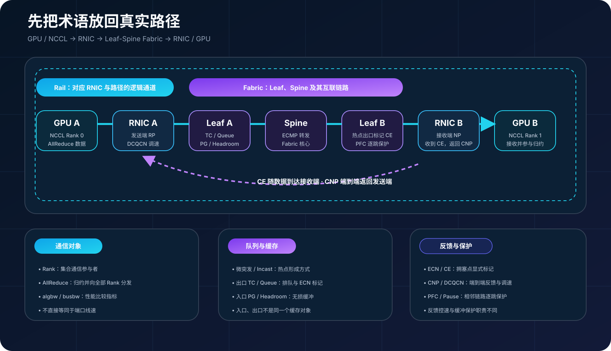
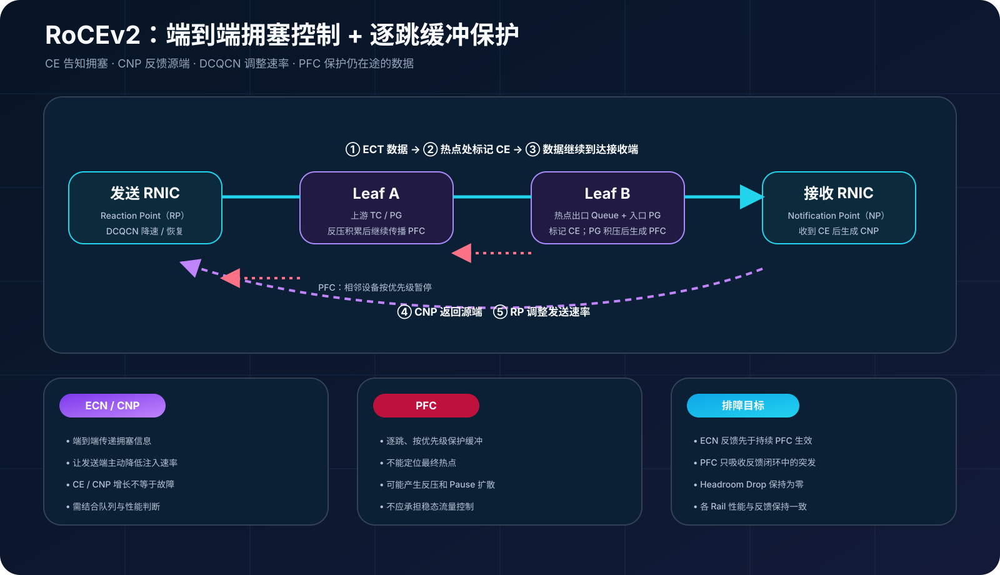
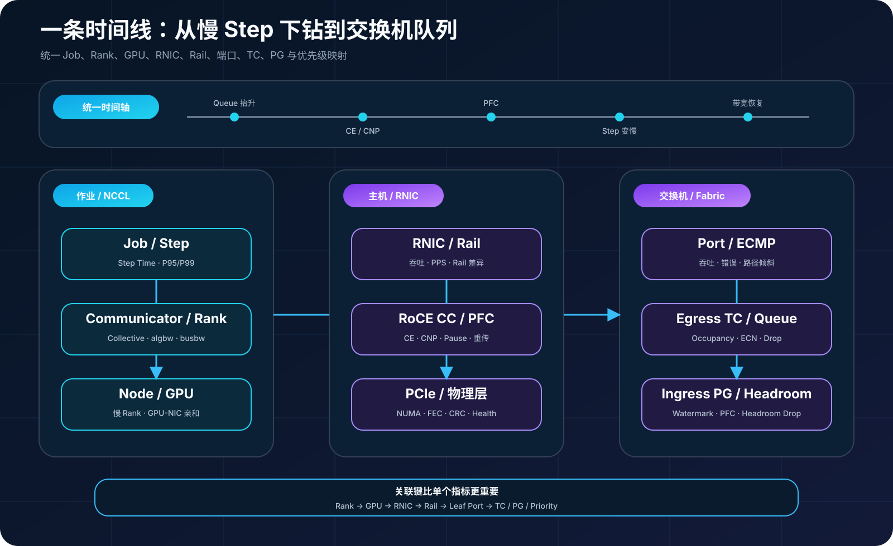
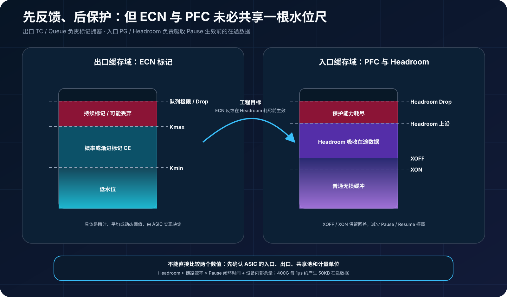
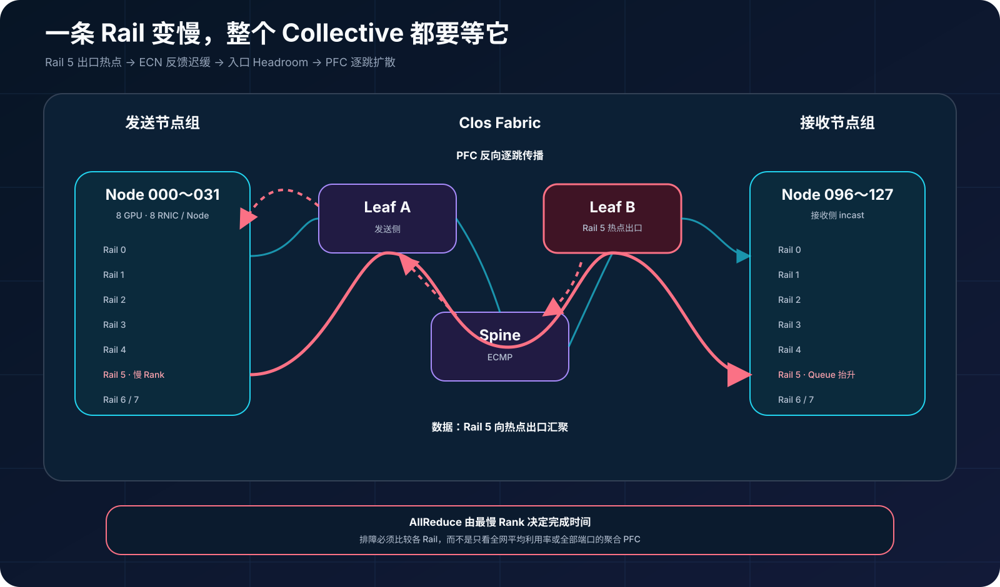
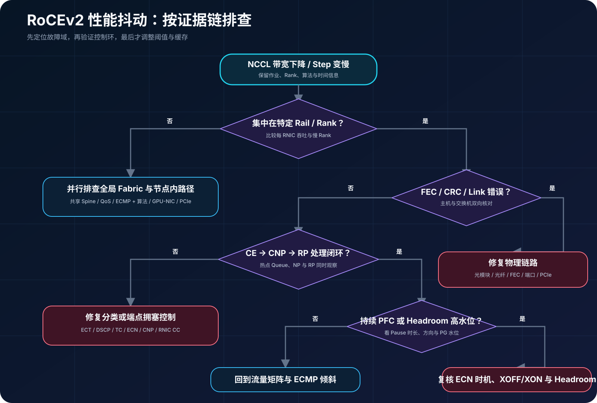

## 0. 前言

上一篇以 128 台八卡服务器、每台 8 张 400G RNIC 为算例，完成了千卡 RoCEv2 网络的 Leaf-Spine、Rail、IP 和交换机规划。网络建成后，新的问题很快出现：链路是 400G，端口平均利用率也不高，为什么 NCCL 带宽还是周期性下降？

这类问题不能只盯着“有没有丢包”。RoCEv2 的性能由应用通信、RNIC 拥塞反馈、PFC、交换机缓存和 Fabric 路径共同决定。本文以一次模拟故障为主线，通过同一时间轴上的主机与交换机指标，还原从微突发到慢 Rail 的完整因果链。

> 本文使用厂商中立的指标语义。命令输出、计数器名称和缓存单位会随 RNIC、驱动、固件及交换机 ASIC 改变，实施时必须以实际设备文档为准。

## 1. 阅读前先懂这些术语

先把本文中的设备、路径和反馈信号放进同一张图里：NCCL 在 GPU 上组织集合通信，数据通过 RNIC 进入由 Leaf 和 Spine 组成的 Fabric；多张 RNIC 又会形成不同 Rail。发生拥塞时，ECN/CNP/DCQCN 构成端到端反馈，PFC 则在相邻设备之间按优先级提供逐跳保护。



| 类别 | 术语 | 本文中的含义 |
| --- | --- | --- |
| 拓扑 | RNIC | 支持 RDMA 的网卡，负责执行 RDMA 传输、DMA 和拥塞反馈，不是泛指所有普通网卡。 |
| 拓扑 | Leaf、Spine、Fabric | Leaf 接入服务器，Spine 连接各 Leaf；二者及其链路共同组成交换网络 Fabric。 |
| 拓扑 | Rail | 跨节点按对应 RNIC 和网络路径组织的逻辑通道。它不是一根网线或一个 VLAN，实际边界取决于服务器接法与网络设计。 |
| 通信 | Rank | NCCL Communicator 中的一个通信参与者，常见部署下通常对应一个进程所使用的一张 GPU。 |
| 通信 | Collective、AllReduce | Collective 是多个 Rank 共同参与的集合通信；AllReduce 对各 Rank 数据进行归约，并把结果分发给全部 Rank。 |
| 通信 | `algbw`、`busbw` | `algbw` 表示应用有效数据量除以时间；`busbw` 按 Collective 通信量模型归一化，用于比较效率，不等于某个端口的物理线速。 |
| 流量 | 微突发、Incast | 微突发是持续时间很短的流量峰值；Incast 是多个发送端同时汇聚到同一接收端或出口的流量形态，两者经常同时出现，但不是同义词。 |
| 缓存 | TC、Queue | Traffic Class（TC）用于分类和调度流量，通常映射到交换机出口队列；ECN 标记常在这一侧依据队列状态触发。 |
| 缓存 | PG、Headroom | Priority Group（PG）聚合入口侧相同流控属性的优先级；Headroom 是为 PFC 生效前在途数据预留的入口缓冲。 |
| 拥塞反馈 | ECN、CE | ECN 是 IP 层显式拥塞通知机制；支持 ECN 的数据包经过拥塞点时，交换机可将其标记为 CE。 |
| 拥塞反馈 | CNP | 接收端 RNIC 收到带 CE 的 RoCEv2 数据包后，向发送端返回的拥塞通知包。 |
| 拥塞反馈 | DCQCN | 发送端 RNIC 可采用的 RoCEv2 拥塞控制算法之一，根据 CNP 等反馈调整发送速率。 |
| 缓冲保护 | PFC、Pause | PFC 通过 Priority-based Pause 在相邻链路间暂停指定优先级，是逐跳流控，不是端到端拥塞控制。 |

如果对这些概念还不熟，可以先阅读 [RDMA 入门：InfiniBand 与 RoCEv2 的数据路径和工程取舍](./rdma-infiniband-rocev2)、[NCCL AllReduce 与 GPU-NIC 拓扑](./nccl-allreduce-gpu-nic-topology)和 [千卡 AI 集群 RoCEv2 网络建设实战](./rocev2-1024-gpu-network-design)。本文后续仍会结合故障过程解释关键机制，不要求读者必须先读完前文。

## 2. 故障现场：平均利用率只有 55%，NCCL 却在抖

算例沿用上一篇的千卡网络：128 台八卡服务器，每台 8 张 400G RNIC，按 GPU-NIC 亲和关系组成 8 个 Rail。一次跨 Leaf 的 AllReduce 压测出现了三个现象：

- NCCL Tests 的大消息 `busbw` 周期性下降，P95 Collective Duration 同步上升；
- 5 分钟粒度的端口平均利用率约为 55%，没有接近 400G；
- Rail 5 的上联偶发大量 PFC Pause，而其他 Rail 相对平稳。

平均利用率掩盖了微突发。400G 链路每微秒可以发送约 50KB 数据；多个发送端在同一时刻汇聚到一个出口时，即使突发只持续几十微秒，也足以让出口队列越过 ECN 阈值，并让反压后的入口优先级组逼近 PFC 阈值。若监控系统每 30 秒或 5 分钟读取一次字节计数器，看到的只是被稀释后的平均值。

另一个容易误判的点是 `busbw`。它是 nccl-tests 根据 Collective 类型对算法带宽换算出的比较指标，并不总等于某条物理链路的实测线速；层次化或硬件加速算法下尤其如此。因此排障时既要看 `algbw/busbw` 的相对变化，也要对照 RNIC 和交换机端口的真实吞吐。[NVIDIA nccl-tests 性能文档](https://github.com/NVIDIA/nccl-tests/blob/master/doc/PERFORMANCE.md)对两种指标的计算方式有专门说明。



## 3. 先分清四个角色：CE、CNP、DCQCN 与 PFC

RoCEv2 拥塞排障的第一步，是把端到端拥塞控制和逐跳流控分开。

1. 发送端把 RoCEv2 数据包设置为 ECN Capable Transport；
2. 交换机发现支持 ECN 的出口队列达到标记条件后，将 IP 头中的 ECN 字段改为 CE（Congestion Experienced）；
3. 接收端 RNIC 作为 Notification Point（NP）收到带 CE 的数据包后，向发送端返回 CNP（Congestion Notification Packet）；
4. 发送端 RNIC 作为 Reaction Point（RP）根据 DCQCN 或设备采用的其他算法降低发送速率，并在后续阶段逐步恢复。

[RFC 3168](https://www.rfc-editor.org/rfc/rfc3168.html)定义了 ECT 与 CE 的 IP 层语义；[DCQCN 原始论文](https://www.microsoft.com/en-us/research/wp-content/uploads/2016/02/lossless.pdf)给出了面向 RoCEv2 的端到端速率控制设计。具体降速幅度、恢复周期和参数接口由 RNIC 实现决定，不能只根据“收到多少个 CNP”反推出唯一发送速率。

PFC 解决的是另一件事。当交换机入口优先级组继续积压并接近无损缓冲边界时，它可以向相邻上游设备发送某个优先级的 Pause，请求暂时停止这一类流量。PFC 是逐跳保护，不会告诉最初发送端“最终热点在哪里”，而且 Pause 可能沿路径向上游扩散。

一句话概括：

```text
ECN + CNP + 端点算法：主动让源端降速，消除持续拥塞
PFC：在反馈尚未生效时保护缓冲，避免短时溢出
```

CE、CNP 或少量 PFC 都不是故障的充分条件。CE/CNP 表明拥塞反馈正在工作；偶发 PFC 可能只是吸收极端突发。真正值得关注的是它们是否与队列持续高水位、Pause 扩散、吞吐下降和尾延迟恶化同时发生。

## 4. 可观测性不是指标堆砌，而是一条时间线

如果作业系统使用 `node-042`，NCCL 日志使用 Rank 337，主机看到 `mlx5_5`，交换机只知道 `leaf-11/ethernet1/42`，即使所有指标都采集了，也很难拼出因果关系。监控系统至少要维护以下映射：

| 维度 | 示例 | 用途 |
| --- | --- | --- |
| 作业与通信 | Job、Step、Communicator、Rank | 找到变慢的 Collective 和 Rank |
| 节点内拓扑 | Node、GPU、PCIe、RNIC | 判断 GPU-NIC 亲和与跨 NUMA 路径 |
| Fabric | Plane、Rail、Leaf、Spine、端口 | 定位热点和故障传播范围 |
| QoS | DSCP、PCP、交换机优先级、TC、PG | 确认分类、队列和 PFC 是否一致 |

所有设备还应使用统一时间源。毫秒级故障未必要求所有指标都以毫秒粒度长期保存，但高频队列水位、事件快照和作业日志必须能够在同一时间轴对齐。



### 4.1 主机与 RNIC 看什么

| 层次 | 核心指标 | 主要回答的问题 |
| --- | --- | --- |
| 训练与 NCCL | Step Time、Collective Duration、慢 Rank、`algbw`、`busbw` | 应用从何时开始变慢，是否集中在特定 Rank |
| RNIC 流量 | 每端口吞吐、包速率、各 Rail 分布 | 是否只有一条 Rail 未被利用或被打满 |
| RoCE 拥塞 | 收到 CE 的包、CNP 发送/接收/处理、CNP ignored | 拥塞反馈是否到达 NP/RP，端点是否响应 |
| PFC | 每优先级 RX/TX Pause 帧、Pause 时间 | 谁在请求暂停，谁正在被暂停 |
| RDMA 可靠性 | RC 重传、超时、RNR NAK、QP/CQ 错误 | 是否存在丢包、接收资源不足或传输异常 |
| 物理与主机总线 | CRC、FEC、丢弃、PCIe 宽度/速率、NUMA | 问题是在 Fabric、物理链路还是 GPU-NIC 路径 |

RNR（Receiver Not Ready）通常说明接收端工作请求或缓冲资源没有及时准备好，不应直接解释成网络拥塞；QP/CQ 错误也属于结果或故障信号，而不是 ECN 控制环的一部分。

Linux 上可以从下面几组入口开始。它们用于发现能力和读取计数器，不代表所有设备都会提供同名字段：

```bash
# RDMA 设备、端口和默认硬件计数器
rdma link show
rdma statistic show
rdma statistic show link mlx5_0/1
rdma statistic mode supported link mlx5_0/1

# 网卡、普通 Pause、FEC 及驱动私有计数器
ethtool -S eth2
ethtool --include-statistics -a eth2
ethtool --show-fec eth2

# PCI 设备健康报告
devlink health show
devlink health diagnose pci/0000:41:00.0 reporter fw

# GPU、NIC 与 NUMA 关系
nvidia-smi topo -m
lspci -tv
cat /sys/class/net/eth2/device/numa_node
```

`rdma statistic`可以展示默认和驱动相关硬件统计，也可以查询设备支持的可选计数器；Linux 的 `ethtool` 统计接口则包含标准组和驱动自定义字段。需要注意，`ethtool --include-statistics -a`展示的是标准链路 Pause，不是按优先级 PFC；PFC 通常要从 `ethtool -S` 的驱动私有字段、RDMA sysfs 或设备专用接口中读取，并逐个 Priority 核对。可分别参考 [rdma-statistic 手册](https://man7.org/linux/man-pages/man8/rdma-statistic.8.html)、[Linux 接口统计文档](https://docs.kernel.org/networking/statistics.html)与 [devlink health 文档](https://docs.kernel.org/networking/devlink/devlink-health.html)。

排查 NCCL 实际选择时，应给日志加上主机、进程和时间信息：

```bash
export NCCL_DEBUG=INFO
export NCCL_DEBUG_SUBSYS=INIT,NET,GRAPH,TUNING
export NCCL_DEBUG_FILE=/var/tmp/nccl-%h-%p.log
```

这些调试变量适合短时诊断，不宜未经评估长期保留在生产启动脚本中。[NCCL Logging](https://docs.nvidia.com/deeplearning/nccl/user-guide/docs/troubleshooting/logging.html)列出了不同子系统及日志级别的用途。

### 4.2 交换机看什么

| 层次 | 核心指标 | 主要回答的问题 |
| --- | --- | --- |
| 端口 | 吞吐、包速率、错误、丢弃、FEC corrected/uncorrectable | 端口是否有物理异常，平均值是否掩盖突发 |
| 出口 TC/Queue | 当前占用、峰值/直方图、ECN 标记、尾丢弃 | 热点出口在哪里，ECN 是否及时工作 |
| 入口 PG/Headroom | 占用、峰值、Headroom Drop | 无损缓冲是否逼近或越过安全边界 |
| PFC | 按优先级 RX/TX Pause、Pause 时长、Watchdog | Pause 从哪里产生，扩散到哪些上游端口 |
| Fabric | ECMP 成员流量、Rail 差异、热点持续时间 | 是否存在路径哈希倾斜或单 Rail 瓶颈 |

队列的峰值和直方图比低频瞬时值更重要。NVIDIA Cumulus Linux 的[高频遥测文档](https://docs.nvidia.com/networking-ethernet-software/cumulus-linux-517/Monitoring-and-Troubleshooting/High-Frequency-Telemetry/)列出了 `tc-ecn-marked`、`tc-occupancy`、`tc-watermark`、`pg-headroom-watermark` 和按优先级 Pause 等语义；其他厂商通常有对应指标，但命名、单位和采样方式不同。

## 5. 阈值关系：ECN 和 PFC 不能画在同一根万能刻度上

常见示意图会把 ECN、PFC XOFF、XON 和 Drop 从低到高画在同一条水位线上。它有助于表达“先反馈、后保护”，但在真实交换机中并不总是同一个缓存对象：

- ECN 通常根据出口 Traffic Class 或 Queue 的占用进行标记；
- PFC XOFF 通常由入口 Priority Group 及其共享/Headroom 缓冲触发；
- 不同 ASIC 可能采用静态阈值、动态阈值、共享池或芯片内部单元进行计量。

因此不能把某个厂商的 `Kmin=150KB` 直接换成另一台交换机的 XOFF。正确做法是先理解 ASIC 的入口、出口和共享缓存模型，再验证四个工程目标：

1. 稳态和常见 incast 下，ECN 标记能够让 RNIC 在入口无损缓冲耗尽前降速；
2. XOFF 触发后，Headroom 足以容纳 Pause 生效前仍在途的数据；
3. XON 与 XOFF 之间有足够回差，避免频繁 Pause/Resume 振荡；
4. 超过极限保护能力时能够观测到明确的 Headroom Drop，而不是把丢包隐藏在聚合计数器里。



Headroom 的最低需求至少与“链路速率 × 反馈闭环时间”相关，闭环中包含线缆传播、对端响应、MAC/PHY、交换芯片流水线以及已经发出的数据。400G 下每增加 1 微秒闭环时间，就多出约 50KB 在途数据；多跳 Fabric 不能把所有端口简单套用同一个线缆距离。NVIDIA 的 [QoS 文档](https://docs.nvidia.com/networking-ethernet-software/cumulus-linux/Layer-1-and-Switch-Ports/Quality-of-Service/)也明确指出，错误的线缆长度会造成缓冲浪费或在流控生效前丢包。

## 6. 还原故障：不是“PFC 太多”，而是 Rail 5 的反馈链断了

把作业、主机和交换机指标对齐后，可以得到一条更可信的时间线：

1. Rail 5 对应 Leaf 上某个出口的队列峰值首先抬升；
2. 该队列的 ECN 标记增长明显晚于其他 Rail；
3. 接收端 NP 侧的 CE/CNP 计数和发送端 RP 侧的 CNP 处理都晚于队列抬升，错过了吸收这轮突发的窗口；
4. 入口 PG 进入 Headroom，交换机向上游发送 PFC；
5. 上游多个端口收到 Pause，Rail 5 吞吐下降；
6. Collective 等待最慢 Rank，整体 `busbw` 随之下跌。

配置核对最终发现两个问题：一台 Leaf 的 RoCE DSCP 到交换机优先级映射与其他设备不一致；修正分类后，该 TC 的 ECN 阈值仍高于同型号其余 Leaf，端点降速来不及在 incast 高峰前生效。

这个结论不能仅靠“PFC 计数很大”得到。PFC TX 指向产生反压的一侧，PFC RX 指向被下游要求暂停的一侧；必须结合端口方向、队列水位和拓扑，才能判断拥塞源与受害者。



## 7. 修复顺序：先分类，再反馈，最后才动缓存

### 7.1 端到端核对分类

建议从数据包字段一路核对到硬件队列：

```text
应用 / RDMA 流量
  → IP DSCP + ECN bits
  → NIC Traffic Class / Priority
  → 交换机 trust mode 与 DSCP→Priority
  → Priority→TC/Queue 与入口 PG
  → PFC enable bitmap、ECN enable TC
```

PCP 只存在于带 802.1Q VLAN Tag 的二层帧中；三层 RoCEv2 Fabric 更常以 DSCP 建立端到端分类，再由每跳交换机映射到本地优先级和队列。无论采用哪种方式，RoCE 数据、CNP 和普通流量的分类与调度关系都必须在所有端口保持一致。

### 7.2 验证 ECN/CNP 控制环

先确认 RoCEv2 数据包是 ECT，热点队列会产生 CE，NP 会生成 CNP，RP 也确实处理 CNP 并调速。若 CE 增长而 CNP 不增长，排查接收 RNIC 与计数器语义；若 CNP 到达但被忽略，排查发送 RNIC 的拥塞控制配置、固件和流量所用 GID/端口。

DCQCN 有降速、拥塞估计和逐步恢复过程，参数彼此耦合。不要为了让 PFC 计数归零就盲目提高降速强度，否则可能以链路利用率和恢复速度为代价。本文不提供跨设备通用参数值；设备默认模板应作为起点，任何修改都必须经过 incast 和 Collective 压测。

### 7.3 最后核算 PFC 与 Headroom

只有分类和端点反馈都正确后，才重新计算 XOFF、XON、共享池和 Headroom。PFC 应只对规划的无损优先级启用，不能对所有队列全局开启。还要验证 PFC Watchdog 行为：它可以在 Pause Storm 或长时间暂停时帮助恢复转发，但恢复动作可能打破无损假设，必须与告警、丢包和作业恢复策略一起测试。

## 8. 看板：从作业下钻到队列

一套可用的 RoCEv2 看板至少有三层：

| 看板层次 | 同屏指标 | 推荐下钻动作 |
| --- | --- | --- |
| 作业层 | Step Time、Collective P50/P95/P99、慢 Rank、`algbw/busbw` | 从 Rank 定位 Node、GPU 和 Rail |
| 主机/RNIC 层 | 各 Rail 吞吐、CE/CNP、PFC、重传、设备健康 | 从 RNIC 映射到 Leaf 端口 |
| 交换机/Fabric 层 | Queue/PG 水位、ECN、PFC、Headroom、ECMP、FEC | 沿路径判断热点、反压方向和传播范围 |

告警应该使用增量、持续时间和关联条件，而不是累计计数器的绝对值：

- **立即告警**：Headroom Drop、不可纠正 FEC、PFC Watchdog 触发、端口或 RNIC 健康错误；
- **持续告警**：PFC Pause 时间占比持续升高，同时队列高水位或作业尾延迟恶化；
- **偏差告警**：同一作业的某条 Rail 吞吐、CE/CNP 比例或队列峰值显著偏离其余 Rail；
- **趋势告警**：可纠正 FEC、重传或 Pause 基线持续恶化。

CE/CNP 单独增长通常说明控制环正在工作，不应直接告警为网络故障；PFC 帧数也会受 Pause Quanta、链路速率和设备实现影响，跨设备比较时优先使用 Pause 时长占比或统一后的速率指标。

## 9. 修复后怎样复测

修复不能只跑一次 `all_reduce_perf`。建议按下面的顺序逐步扩大故障域：

1. 用 perftest 的主机内存模式建立单端口单流 RDMA 基线；验证 GDR 时，必须使用支持 CUDA 的 perftest，并在两端指定 `--use_cuda=<GPU>` 或 `--use_cuda_bus_id=<PCIe ID>`，采用 DMA-BUF 时再加入对应选项。具体能力与版本要求可参考 [perftest GPUDirect 文档](https://github.com/linux-rdma/perftest#4-gpudirect-usage)；
2. 增加多 QP、多发送端 incast，观察 CE/CNP 是否先于持续 PFC 出现；
3. 用 NCCL Tests 对比单节点、同 Leaf、跨 Leaf、单 Rail和多 Rail；
4. 在业务允许的演练环境中制造单 Rail 限速或热点，验证可观测链路和告警；
5. 重复测试并记录 P50/P95/P99，而不是只保存最好的一次结果。

本次模拟故障的验收标准不是“所有拥塞计数归零”，而是：大消息 NCCL 带宽恢复且抖动收敛；各 Rail 分布接近；ECN/CNP 在 incast 时及时增长；PFC 仅在极端突发时短暂出现；Headroom Drop、Watchdog、不可纠正 FEC 和 RDMA 错误保持为零。



## 10. ECN-only 不是简单关闭 PFC

RoCEv2 的可靠传输可以在有损 IP 网络上通过重传恢复，一些平台也支持以 ECN 为核心、不开启 PFC 的模式。但这不意味着在现有 PFC + ECN 网络中执行一次“no pfc”就能得到更好的系统。

ECN-only 需要交换机和 RNIC 对拥塞及丢包作出足够快、可预测的响应，还要重新验证队列、端点算法、重传代价、流量规模和尾延迟目标。NVIDIA Cumulus Linux 的 [RoCE 文档](https://docs.nvidia.com/networking-ethernet-software/cumulus-linux/Layer-1-and-Switch-Ports/Quality-of-Service/RDMA-over-Converged-Ethernet-RoCE/)同时提供 lossless（PFC + ECN）和 lossy（ECN）模式，也提醒不同 ASIC 的生成配置不能直接互用。

因此本文仍以 PFC + ECN 为主线：让 ECN/CNP/端点算法承担日常拥塞控制，让 PFC 只保护反馈闭环中的短时在途数据。是否进入 ECN-only，应被视为一次新的网络设计与验收，而不是局部参数优化。

## 结语

400G 只是链路速率，不是应用性能保证。一次 NCCL 抖动可能起于几十微秒的出口热点，经错误的分类和迟缓的 ECN 反馈进入入口 Headroom，再通过 PFC 扩散成整条 Rail 的停顿。

真正有效的排障方法，是把作业、Rank、GPU、RNIC、Rail、交换机端口、队列和优先级放到同一条时间线上。先证明流量去了哪里，再证明拥塞在哪里形成，最后确认反馈为什么没有及时生效。只有这样，PFC、ECN 和 DCQCN 才不再是一组孤立参数，而是一套能够被观察、验证和持续运营的控制系统。
